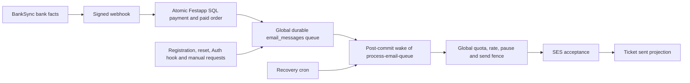

# BankSync integration implementation

Source worktree: `festapp-banksync`, branch `implementation/banksync-20261004`, isolated from the user's dirty Festapp checkout. Festapp changes remain uncommitted. Canonical BankSync is an independent shared service; Festapp and Mendelio are consumers. All order matching, alias decisions, paid state, and ticket behavior remain Festapp SQL responsibilities.

## Contract

Festapp pins `@festapp/banksync@0.2.2` and explicitly verifies webhook v2. V2 retains original VS, payer reference, signed integer minor units, bank date, movement/command distinction, and provenance. BankSync does not synthesize order identifiers into canonical bank facts. Existing Mendelio v1 incoming-only projection and archived webhook bytes remain compatible.

The receiver authenticates exact raw bytes before one SQL transaction commits inbox, account mapping, strong movement identity, ledger, existing matcher, and durable receipt. Unknown mappings, unproven email movement IDs, shadow/suspended accounts and fact conflicts cannot silently credit a payment. Duplicate delivery or a new delivery for the same movement cannot re-credit manually unpaired history. SQL authority barriers serialize activation with old writers and never clear on suspension.

## Control recovery

A BankAccountAdmin begins a hashed intent; a matching active intent resumes across browser sessions. The server durably stages non-secret request fields and an AES-GCM token ciphertext bound to the operation ID and intent hash. Completion deletes the stored ciphertext. Key configuration is mandatory before accepting token operations:

- `BANKSYNC_CONTROL_KEY_VERSION=1`
- `BANKSYNC_CONTROL_KEY_1`: base64 encoding of an independently generated 32-byte key, kept in the protected Edge Function secret store; never reuse a bank token or commit this value.
- Keep older numbered keys while unresolved operations still reference them.
- `BANKSYNC_INSTANCE_ID`, `BANKSYNC_API_URL`, `BANKSYNC_TENANT_ADMIN_KEY`, `BANKSYNC_WEBHOOK_SECRET` configure the one shared BankSync instance and isolated Festapp consumer.

`bank-sync-reconcile` authenticates the existing cron request secret and resumes persisted intents after the five-minute fencing lease. Remote account creation stays paused and tokenless until local mapping, owner subscription and authority activation survive commit. Pairing rotation records the pre-operation code and reconciles a lost response. A changed token is proved by its full digest. No browser token persistence or direct user access to service RPCs is needed.

## Source deletion ledger

| Path | Result and retained scope |
| --- | --- |
| Ticket dispatch inside `synchronize-orders` | Already removed by current upstream. Preserve canonical `enqueue_paid_order_tickets` / `email_messages` / `process-email-queue`; no second scanner or queue. |
| Canonical account legacy transaction/email/token/secret/pairing writes | Rejected atomically by the durable authority barrier, including old clients. |
| Canonical account direct Fio fetch and pointer writes | Excluded from both fetchable RPCs; explicit synchronization uses BankSync tenant control. |
| Unapproved accounts in legacy fetch/RPC paths | Retained for their existing consumers; they are never a fallback for a canonical account. Remove only after separately approved account rollout. |
| Old active email addresses/SES routing | No migration: selected scope was confirmed as token-only. Global legacy handlers remain an external boundary for unapproved accounts. |
| BankSync fuzzy transaction discard | Removed. Transport and verified bank identity deduplication remain account scoped. |
| BankSync reference helpers/v1 adapter | Retained as the existing public compatibility boundary for Mendelio; v2 canonical persistence does not apply it. |
| Existing manual/CASH/General/ČSOB and payment matcher | Preserved as legitimate application behavior. |

## Validation

BankSync: 565 tests, typecheck, package build/export, production audit, staged secret scan, fresh and original v9-to-v11 local D1 migrations, Worker dry-run. GitHub required check, dependency-review, secrets and CodeQL checks gate each package PR. Original 0.2.0 promotion was superseded before npm publication by the archived-statement recovery fix in 0.2.1; tags remain immutable.

Festapp: five targeted SQL suites (identity/ledger, permissions/barriers, fault rollback, durable operations), five existing payment regressions, two-session concurrency (late legacy writer, duplicate HTTP receipt, two payments, manual unpair/replay), Deno function checks, four receiver tests, credential encryption and both credential-scoping tests, plus five registration/Auth queue-adapter tests, seven Dart account tests. Dart analysis has no errors; eight existing style/deprecation infos remain across the component. Receiver-to-real-SQL validation passed against the published registry package, including signed ledger totals, duplicate delivery and changed-body rejection. It is recorded in `validation.json`.

Regenerate the migration from canonical sources with `python3 automation/assemble-bank-sync-migration.py`. The schema source and migration do not introduce persistent application triggers. Separate approved cron installation uses `install-control-reconcile-cron.sql`; do not run the global bootstrap script to install this job. Existing email queue recovery remains independent.

## Production gates remain open

M1 and M2 are not production-complete. Nothing here deploys Festapp or the shared Worker, migrates production databases, transfers bank tokens, provisions consumers, changes MX/SNS, fetches real bank data, or replays deliveries. Package publication is the separately authorized exception.

The October 3 evidence snapshot is retained, not a fresh production inventory. It identifies tenant `festapptickets`, organization 3, seven enabled selected Fio accounts and one duplicate normalized physical account. It contains aggregate counts, not executable account mappings. Before production, bind the reviewed manifest to exact local/remote/physical account IDs, ledger high-water marks, currency sets, approved aliases and current delivery incident dispositions. B2 terminal jobs and B3 physical duplication remain unresolved; do not auto-merge rows or blindly replay jobs.

Production order: compatible BankSync composition and Fio proxy supporting bounded `/periods`; schema 11; Festapp SQL/receiver/cron routes and protected secrets; isolated v2 Festapp consumer and paused mapped accounts; bounded historical reconciliation; reviewed authority activation; polling/receipt/ledger comparison and real authorized CZK/EUR payments with ticket delivery. Existing Mendelio consumers retain v1. Do not deploy other tenant branches.

New email ingress requires shared Worker `AUTHENTICATED_EMAIL_SPOOL=on` and encrypted BACKUPS/R2 storage, verified bank sender authentication, exact server-owned receiving address, and actual bank email evidence. Current Fio/AirBank email identifiers are observations until movement identity is proven. They persist safely and are quarantined by Festapp; they cannot yet establish automatic email payment completion. M2 requires that evidence and a verified email journey, not a simulated claim.

The Mendelio composition checkout contains unrelated user changes. Only `supabase/functions/fio-proxy/index.ts` was changed for bounded period requests, validation and timeout; it is uncommitted and undeployed. A later shared Worker release must pin the published package in the composition catalog/lockfile under that repository's publication rules and validate the existing v1 consumer.

Upstream refresh: Festapp was fast-forwarded from 3912447c8 onto 148385676 before final handoff. Current upstream already enqueues ticket email intents transactionally through `enqueue_paid_order_tickets`; the initially prepared parallel ticket scanner and lease were removed. Routed bank dialog loading/draft behavior, email proof routes, SES worker scoping and canonical queue cron were preserved. Only the new control reconciliation cron is added.

For immediate validation of the newly published owned package, Deno needs `--minimum-dependency-age 0`. The real SQL script under the Node-based web client also needs `--node-modules-dir=none`, so it resolves the exact npm pin from the Deno cache without modifying the web client dependency tree. Production operators must honor their dependency-age policy or explicitly review this exact release.

## Event-driven tickets and universal email gate

The user explicitly requires ticket delivery to react to a confirmed bank webhook without waiting ten minutes, while all message kinds remain subject to the global queue. The existing canonical owner already supports this: matcher -> payment recalculation -> paid order/tickets -> `enqueue_paid_order_tickets` -> immediately due `email_messages` intent -> transaction-coalesced pg_net wake after commit -> `process-email-queue` -> global SQL send gate -> provider acceptance -> ticket post-action.

Refactored `recalculate_order_payment_status` to propagate a failed JSON paid-transition result. Previously `update_order_and_tickets_to_paid` could roll back its order/intent subtransaction and return code 500, while the caller ignored it and acknowledged the bank payment. Now the ledger, pairing, paid state, intent and receiver receipt succeed or roll back together. The existing public transition JSON contract remains available to its other callers.

`bank_sync_ticket_delivery_test.sql` proves partial payments do not release tickets; the completing payment creates one immediately due intent and one worker wake without a cron; webhook retries create no second intent; global pause and exhausted daily quota defer sending; only restored global capacity and provider acceptance advance tickets to sent; forced intent failure leaves no credited payment, ledger or success receipt.

Registration, sign-in/reset, Auth-hook, custom and deletion producers were traced to the same queue. The only SES transport caller is `process-email-queue`. Its credentials are stripped from other worker environments, and signed GoTrue hooks replace SMTP in the runtime overlay. Security priorities still use the shared global quota/fence. No new direct sender or automatic bypass was introduced.

Local verification was extended by applying the existing canonical email migration and relevant current email guard/history migrations to the disposable fixture only. Both receiver-to-SQL tests and global email gating can therefore exercise actual canonical queue functions. Nothing was sent to a real address; pg_net wake tests target loopback and roll back. The bank API remains polling based, so the guarantee is immediate queue activation after the webhook commits, subject to global email capacity, not an invented exact bank posting timestamp.

BankSync 0.2.2 adds immediate dispatch through its existing webhook delivery coordinator after schema 11 imports; periodic reconciliation remains transport recovery. A failed Queue send remains durable and a later import re-drives it without a second bank movement. This generic transport change serves every consumer and introduces no order or ticket rules into BankSync.

`shared-composition-update.patch` is a reviewable draft for the existing Mendelio composition: pin catalog/minimum-age exclusion to the reviewed 0.2.2 package, add the Festapp callback host, enable authenticated independent email spool, and include the bounded Fio proxy change. It is not applied to shared catalog/config files because the checkout also contains an unrelated mobile package edit. In a clean composition checkout, apply the patch, regenerate pnpm lockfile, then run the documented composition typecheck/tests/dry-run. Publication/deployment still follows that repository rules and the reviewed production manifest.
