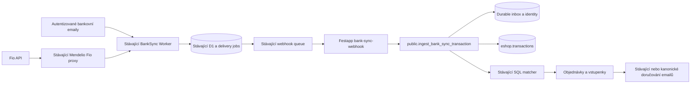

# Festapp přes existující BankSync: průzkum a plán bezpečného přepnutí

Datum: 2026-10-03  
Stav: implementace v izolovaném checkoutu zahájena 2026-10-04; produkční přepnutí má brány níže  
Verification: standard - platby, autorizace, sdílená instance a databázové migrace  
Rozsah aktuálního zadání: uživatel 2026-10-04 autorizoval implementaci a potřebnou publikaci balíčku; produkční změny vyžadují samostatný schválený manifest.

## Výsledek a závěr

Festapp má používat **stejný Worker, D1, fronty a Fio proxy, které používá Mendelio**. BankSync bude jediný vlastník automatického příjmu bankovních pohybů. Festapp si ponechá svůj účetní ledger, správu oprávnění k účtům, párování, přepočet objednávek a vstupenek. Nevytvářet další instanci ani kopii parseru.

Sdílená instance je technicky použitelná. **Současnou verzi nelze bezpečně jen připojit a přepnout.** Potvrzené mezery mohou zahodit skutečnou platbu, zaměnit identitu pohybu, ztratit EUR referenci nebo odchozí pohyby. Je nutná nejprve cílená změna kanonického BankSync, potom Festapp adaptér a teprve nakonec řízené předání jednotlivých účtů.

**Poslední upřesnění uživatele:** migrují se pouze současné Fio tokeny. Ve vybraném rozsahu nejsou podle uživatele aktivované bankovní emaily, takže se nemigrují staré emaily, adresy ani SNS/MX cesty. Nové emailové napojení musí být implementováno a správně fungovat jako povinná část hotové integrace. Fio tokeny lze předat hned po jejich bezpečnostních a funkčních branách, emailová práce probíhá v témže zadání a dokončení se bez ní nevykazuje. M1 nesmí zavést trvalý email fallback mimo BankSync.

To není migrace objednávek nebo jejich přečíslování. Neměnit VS, RF, čísla účtů na vystavených objednávkách, `payment_info`, ruční transakce ani historické párování. Změnit vlastníka importu a bezpečně navázat jeho fakta na existující ledger.

## Rozsah a autorita

- Sdílené změny vzniknou na autoritativním `main` podle pravidel příslušných repozitářů. Festapp byl zkoumán z existujícího pracovního checkoutu `release/ticket-editor-ui-20261003`, SHA `e380979aad1573cb82f9dc91f0f2fffa23280ef2`. Tento pracovní stav není automaticky publikační autorita; přesný zachycený stav je také v evidence JSON. Checkout obsahoval nesouvisející rozepsané změny. Neměnit je ani zahrnout do budoucí publikace.
- Výchozí produkční pilot: aktivovaný tenant `festapptickets`, `https://vstupenky.online`, organizace `3`, endpoint `https://api.festapp.net`, generation `1`. Žádná produkční větev jiného tenanta není tímto plánem autorizována k buildu nebo nasazení.
- Sdílená databáze může mít účet použitý více organizacemi. Před pilotem vybrat účet, jehož změna importu nezasáhne neodsouhlasený rozsah, nebo tento dopad výslovně zahrnout do konkrétního rollout manifestu.
- Čtení souhrnů ostatních částí společné databáze a Mendelio instance sloužilo k posouzení dopadu, není oprávnění opravovat jejich historii, přehrávat platby nebo měnit subscriptions.
- BankSync zdroj: `/Users/miakh/source/banksync`, repozitář `festappnet/banksync`. Mendelio kompozice: `/Users/miakh/source/roman_seznamka/services/banksync`. Festapp: `/Users/miakh/source/festapp`.
- Současné zadání neautorizuje commit, push, migraci, registraci consumera, změnu tajemství, SNS/MX/routing, bankovní API volání posouvající kurzor, replay ani deployment. Tyto kroky jsou budoucí provozní fáze.
- ČSOB a obecné účty zůstanou použitelné pro objednávky a ruční evidenci. BankSync dnes nemá jejich parser ani API; přítomnost banky v sender allowlistu není implementace podpory.

## Jak byl průzkum proveden

Přečteny `CLAUDE.md`, `docs/architecture/ai_context.md`, bank-account README, SQL importy a matcher, obě Fio Edge Functions, SNS ingress, UI správa účtu, cron bootstrap a souběžný e-mailový plán. V BankSync sledovány parsery, normalizace, ověření emailu a webhooku, D1 deduplikace, polling/backfill, subscriptions, doručování, replay, retention a proxy v Mendeliu. Mendelio consumer slouží jako reference hranice, ne jako modul k přímému kopírování do Festappu.

Ověřen živý activation dokument, SSH hostname, aktivní runtime database a existence organizace `3`. SQL diagnostika používala explicitní read-only transakce. Výchozí soukromé assertions skillu uvádějí jiného tenanta/organizaci; rozsah byl odvozen z aktuálního `project.conf` a živé aktivace, nikoli slepě z výchozí organizace skillu. `cron.job` je na tomto serveru v databázi `postgres`, nikoli v aplikační databázi.

Cloudflare diagnostika byla pouze čtecí: aktuální deployment/version bindings a D1 agregace. Nebyly čteny tokeny bank nebo těla plateb. Porovnání čísel bankovních účtů proběhlo pouze v paměti procesu; uloženy jsou jen počty. Veřejná dokumentace Fio potvrzuje význam ID a chování kurzoru.

Důkazy: `docs/plans/evidence/banksync-2026-10-03/observations.json`. Obsahuje souhrny, konkrétní deployment a výsledky testů, bez tajemství, čísel účtů, zákaznických řádků a částek. Pozorování jsou časový snímek, před rolloutem se musí obnovit.

## Ověřený současný stav

| Fakt | Konkrétní důkaz | Důsledek |
|---|---|---|
| BankSync běží jako jedna sdílená instance | Mendelio `services/banksync/wrangler.toml`; živý Worker version `1ee1572b-8289-47c7-b682-6d716a8419e9`, 100 % provozu, deployment 2026-09-24 | Použít tuto instanci a stávající D1/fronty/proxy |
| Živý D1 je schema 10 | `schema_meta`; kanonické migrace BankSync | Existující DB nerozjíždět fresh baseline; další migrace mají číslo >= 0011 |
| Lokální BankSync a Mendelio dependency jsou 0.1.6 | oba manifesty/catalog; BankSync HEAD `cc2c605fa7ffe023e468eb355d63e3f391d3d286` | Historický `PRODUCTION_CUTOVER.md` uvádí 0.1.5 a není aktuální inventář; přesná verze nasazeného balíčku nebyla odvozena z bundle |
| D1 obsahuje 5 účtů a 4 consumery | D1 agregace: dating, tutoring, voice, michael-airbank | Festapp consumer zatím neexistuje; historický michael-airbank neobsadit ani nepřejmenovat |
| Dva Fio API účty aktivně stahují | živé success 2026-10-03 21:05:18 a 21:05:19 UTC; error NULL | API cesta přes stávající Mendelio proxy funguje v okamžiku kontroly |
| Doručování má historické i novější incidenty | 26 delivered, 428 terminal, žádné active; tutoring 12 vyčerpaných retry až 2026-09-23, voice 3 až 2026-09-20 | Nulová aktivní fronta neznamená bezchybný systém. Není důkaz, že jsou obchodní dopady vypořádané |
| Aktivovaný tenant má 15 účtů | organizace 3: FIO 8, CASH 4, CSOB 1, General 2; Fio fetch enabled 7 | Pilotovat automatické účty, nezrušit ruční/hotovostní správu |
| Účty jsou sdílené mezi jednotkami | `eshop.unit_bank_accounts`, `eshop.bank_account_users`, README | Mapovat bankovní účet, nikoli occasion nebo jednotlivou jednotku |
| Vybrané Fio účty neodpovídají existujícím BankSync účtům | CZ IBAN/domestic normalizace: 0 shod; jedna duplicita mezi 8 Festapp Fio záznamy | Nevytvářet mechanicky 8 remote účtů. Nejprve sloučit import pro duplicitní fyzický účet bez sloučení historických ledgerů |
| Používají se CZK i EUR | vybrané account currency sets: 13 CZK, 1 CZK+EUR, 1 EUR | RF a bezeztrátový převod částek jsou povinné |
| Dnešní import ukládá i záporné pohyby | `insert_transactions.sql`; v celé kanonické DB 847 nonpositive, z toho 54 `fio_api` | Incoming-only BankSync je funkční regrese. Nezaměňovat tyto celkové počty za statistiku tenanta 3 |
| BankSync zahazuje podobné platby | `src/db.ts:findFuzzyDuplicate/insertTransaction`, UNIQUE `idx_tx_fuzzy_same_day` | Neřeší se pouze Festapp receiverem: druhá platba se k němu vůbec nedostane |
| Parser Fio emailu směšuje command a movement | `src/parser.ts:parseEmail`, `ID pokynu` uložen jako `transaction_id`, `command_id=NULL` | Číselná shoda s API movement ID není důkaz totožnosti |
| Fio API reference plátce se ztrácí | BankSync `src/fio.ts:mapFioTransaction` nepřenáší column27; `types.ts` nemá samostatnou referenci | Festapp `payer_reference` a RF matcher nelze věrně naplnit |
| Festapp má jeden explicitní matcher | `match_bank_transaction -> apply_transaction_pairing -> recalculate_order_payment_status` | Zachovat doménu v SQL, nevytvářet mark-paid logiku v Edge Function |
| Receiver potřebuje business receipt | BankSync `src/webhookSender.ts:readReceipt` vyžaduje `ok=true`, version 1, shodné delivery ID | Prosté HTTP 200 nebo `{success:true}` není úspěšné doručení |
| Delivery ID a bankovní identita jsou různé | `webhookDelivery.ts`, `types.ts` | Retry inbox dedup a dedup skutečného pohybu jsou dvě oddělené unikátní hranice |
| Subscriptions platí podle času importu | `ensureDeliveryJobs`: subscription interval vůči `transactions.created_at` | Přidání subscription nedoručí automaticky dřívější transakce |
| BankSync backfill není bezpečný jako cutover sám o sobě | `runBankApiSync`: reset 90 dní; první data bez přímého enqueue; sweep je ale může později doručit podle intervalů | Nespoléhat na komentář „backfill bez webhooků“; nastavit explicitní consumer/cutover politiku |
| UI email adresa používá jiný formát | Festapp `bank.<UUID>@bank.festapp.net`; BankSync `extractPairingCode` čeká hex localpart, nové kódy 10 znaků | Přepnutí DNS nebo prosté forwarding není hotová migrace |
| Živá callback policy neobsahuje Festapp API | bindings: pouze mendelio.net, muzazena.festapp.net, voice.mendelio.net | Přidat přesně `api.festapp.net`, nepoužívat wildcard ani oslabit allowlist |
| Cron míchá bankovní import a vstupenky | `synchronize-orders/index.ts`; cron `festapp_canonical_synchronize_orders` po 10 minutách | Odstranit bankovní polling nesmí vypnout zasílání vstupenek |
| Datum transakce je bez timezone | živé `eshop.transactions.date: timestamp without time zone`, DB timezone UTC | Explicitní UTC převod; nekopírovat implicitní cast nebo přepisovat historii |

### Dnešní tok

1. Automatický cron nebo editor objednávek volá `synchronize-orders` / `fetch-transactions`.
2. Edge získá bankovní token z Festapp `eshop.secrets`, případně posune Fio zarážku o 90 dní a zavolá `/last`.
3. `insert_transactions` vloží bankovní pohyb a zavolá SQL matcher. Matcher vyžaduje účet + měnu + jednoznačný VS/RF, zamkne transakci a použije `apply_transaction_pairing`.
4. Párování přepočítá paid/returned, stav objednávky a vstupenek; u zálohové platby může vytvořit záznam `queue_emails`.
5. Druhá část `synchronize-orders` hledá zaplacené objednávky pro `send-tickets`. Je za podmínkami a early returns bankovního importu - po jeho vypnutí ji nelze nechat závislou na existenci Fio účtu.
6. Alternativní emailový vstup: AWS SES/SNS -> ověřený `bank-mail-parser` -> `process_email_transaction` -> tentýž matcher. SNS external ID není MIME Message-ID BankSync; nepoužívat je jako vzájemně identickou transportní identitu.

### Co ověření skutečně prokázalo

Cílený lokální příkaz v repozitáři BankSync:

```sh
pnpm exec vitest run src/db.test.ts src/fio.test.ts src/parser.test.ts src/relay.test.ts src/webhookDelivery.test.ts src/webhookDeliveryCoordinator.test.ts src/email_auth.test.ts
```

Výsledek: 7 souborů, 113 testů prošlo. Testy popisují dnešní smlouvu, včetně fuzzy deduplikace; nejsou potvrzení vhodnosti pro Festapp.

Samostatný syntetický pokus přes současný `dist/index.js` a SQLite baseline:

- vložení dvou Fio pohybů se dvěma různými movement ID, stejným VS/částkou/měnou/dnem: první insert 1, druhý insert 0;
- email `ID pokynu: 987654`: `transaction_id=987654`, `command_id=null`;
- Fio JSON s column27 RF: reference v mapovaném výsledku chybí.

Tyto tři mezery jsou reprodukované, nikoli hypotetické. Nebyly spuštěny produkční fixture/testy ani bankovní `/last`.

## Cílová architektura



### Vlastnictví a hranice

- **BankSync:** autentizace provider vstupu, účet/token, intervaly a recovery Fio, parsování a normalizace úplných faktů, evidence pohybů, delivery jobs a HMAC. D1 není Festapp účetní ledger a jeho retention nesmí odstranit jediný důkaz nevyřešené platby.
- **Festapp:** oprávnění uživatelů, propojení account/unit, checkout routing měn, `payment_info`, audit transakcí, ruční evidence, matcher, vyhodnocení záloh/přeplatků/storna, objednávky, vstupenky a doménové emailové záměry.
- **Mendelio:** dál provozuje kompozici sdíleného Workeru a proxy. Sdílená změna nesmí způsobit druhé účtování nebo neočekávané doručení starých plateb do dating/tutoring/voice.
- **Consumer:** nový jednoznačný `app_id=festapp`, vlastní signing secret a tenant admin key. Platformové admin tajemství pouze pro omezené provisioning/cross-owner zásahy, nikdy do mobilu nebo browseru. Použití celé Festapp DB je oddělené od oprávnění jednotlivých Festapp uživatelů.
- **Callback:** `https://api.festapp.net/functions/v1/bank-sync-webhook`, bez JWT gateway požadavku a s vlastní povinnou HMAC autentizací. Ověřit i konfiguraci self-hosted function routeru, nestačí vložit stanza do cloud-only `supabase/config.toml`.

### Nevyjednatelné invarianty

1. Jeden fyzický účet má v BankSync jeden kanonický import; žádné souběžné použití stejného Fio tokenu Festappem a BankSync. Zamykání je per credential/account a sdílené mezi manual, cron, queue a recovery voláními.
2. Dvě skutečné platby se stejným VS a částkou se nesmí spojit bez shody ověřené bankovní identity. Podobnost je pouze diagnostika, ne UNIQUE finanční hranice.
3. `movement_id`, `command_id`, MIME Message-ID, SNS MessageId, D1 row ID a delivery ID nejsou zaměnitelné. Zdroj a identitní typ musí být explicitní.
4. Replay stejného delivery ID vrátí stejný uložený receipt bez nové platby, párování nebo emailu. Stejné ID s jiným hashem je konflikt a neprovede žádný side effect.
5. Jedna skutečná bankovní platba nesmí být dvakrát připsána ani po novém delivery ID, novém subscription nebo po 90denní D1 retenci.
6. Účet z payloadu se hledá v serverové mapping tabulce v namespace instance/consumer. Nikdy `remote_id == local_id`, nikdy mapování pouze přes VS nebo occasion. Podpis není oprávnění změnit libovolný lokální účet.
7. Pouze Festapp SQL rozhoduje o párování podle účtu, měny a nezaměněné reference. D1 heuristicky doplněné VS nesmí přebít skutečný structured VS/RF konflikt.
8. Částky jsou přesné signed minor units a v SQL `numeric`; CZK/EUR/USD mají dnes exponent 2. Nepoužívat JS `/100` jako autoritativní finanční výpočet. Nepodporovaná měna/exponent je explicitní karanténa, ne implicitní CZK.
9. Odchozí pohyby se zachovají v ledgeru, ale automaticky nezaplatí objednávku ani se samy neoznačí za ruční refund. Ruční/hotovostní cesty nejsou importní fallback.
10. DB insert, identity, matcher a inbox receipt jsou jedna transakce. DB chyba se neoznačí trvale „processed“; transport dostane retryable chybu.
11. Obchodně nerozpoznaná platba je durable `unmatched/ambiguous/ineligible`, není HTTP 5xx. Pozdější ruční reconcile je nová autorizovaná doménová operace, transport replay ji nesmí předstírat.
12. Vyřazení Fio cronu nesmí zrušit vstupenky nebo emailové záměry. Úspěch receiveru není „email už byl odeslán“.
13. Žádné persistentní aplikační DB triggery. Vše přes explicitní SQL/RPC/worker hranice, migration ledger a ověřené permissions.

## Mezery BankSync a jejich řešení před pilotem

### G1 - Nesprávná identita a příliš široká deduplikace: blokuje

`src/parser.ts`, `src/db.ts`, D1 `idx_tx_fuzzy_same_day` a testy změnit společně.

- `ID pokynu` ukládat do `command_id`. Skutečný movement ID má vlastní field/source, Fio API column22. Neprohlásit obecný text „Transaction ID“ za movement bez provider fixture a ověření významu.
- Odebrat fuzzy UNIQUE i hard-skip podle VS/částky/dne +/- 3 dny. Zachovat scoped strong identity dedup a transport replay. Dvě odlišná movement ID vždy dvě platby.
- MIME ID dedup scoping přizpůsobit účtu/ověřenému recipientovi; dnešní globální external_id nesmí zahodit druhý legitimní bankovní účet stejného transportu.
- Zabránit automatickému slučování jen podle command ID. Živý Festapp obsahuje jeden případ command ID použitého ve více řádcích; command ID není obecná unikátní movement identita.
- Existující D1 emailové `transaction_id` mohlo vzniknout z obou různých labelů. Nemigrovat hromadně „všechno emailové ID -> command“ ani nepřepisovat už doručené immutable payloady. Zaznamenat neověřenou historickou provenienci, porovnat s autorizovaným výpisem a opravy vést odděleně s auditem. Neprovádět automatický replay Mendelio historie.
- První Festapp rollout použije u tokenových Fio účtů `api` režim. Nové email napojení je povinné pro M2; `both` nezapnout, dokud není skutečně prokázaná korelace email/API a bezduplicitní finanční identita. Email bez bankovní movement identity uložit jako nefinální pozorování pro operátora, nepřipsat automaticky jen podle doručovacího ID.

### G2 - Úplnost faktů a smlouva: blokuje

Zavést explicitní event contract `transaction.received`, **event_version `'2'`**, odděleně od stále platné `receipt_version: 1`.

- Zachovat všechna existující bankovní data; přidat `payer_reference` z Fio column27, `raw_vs` a explicitní metadata identity/provenience a směru. `vs` nesmí heuristicky skrýt původní hodnotu; Festapp matcher použije skutečné nosiče.
- Umožnit signed `amount_cents` a direction `incoming/outgoing/zero`; upravit D1 CHECK, API mapper i verifier. Nulový pohyb auditně uložit, nepárovat. Nenutit zápornou částku do positive verifikátoru verze 1.
- IDs zachovat jako text bez numerického zaokrouhlení. Fio JSON číselná ID ověřit jako safe integer nebo použít lossless parsing; nespravitelné ID nedoručovat jako důvěryhodnou identitu.
- Částky normalizovat z přesné desetinné reprezentace, hlídat safe minor unit range a exponent. Současné `Math.round(number * 100)` není univerzální přesný bankovní parser.
- Verifier musí validovat parseable date, currency support, direction/sign soulad, raw reference a identity metadata, nejen existenci nenulového date stringu. Producer nemá nahradit neznámé datum bankovní platby časem importu jako domnělý bankovní fakt.
- Nezapsat nedůvěryhodné `payer_reference` jako automaticky platný RF; checksum a konflikt se structured VS posuzuje Festapp SQL.
- Přidat explicitní consumer capability `event_version`: nový Festapp consumer dostává v2, existující dating/tutoring/voice zůstávají na své v1 veřejné smlouvě. Jedna canonical fact persistence, cílené projekce na hranici příjemce. Pro v1 vytvářet pouze incoming jobs s původním shape; outgoing/zero nikdy neposlat starému verifieru. Writer nezačne posílat v2 consumerovi před nasazením jeho v2 readeru. Není nutný rollout tří Mendelio aplikací kvůli Festappu; jejich kontrakty se ověří cílenými regresními testy.
- Historické v1 delivery job payloady zůstávají byte-for-byte neměnné. Bounded v1 reader je nutná externí archivní/replay hranice; není druhý import; podporovaný v1 external consumer serializer je záměrně zachovaný. Mendelio v1 smlouva je samostatná pojmenovaná product boundary a zůstává podporovaná, dokud není zvlášť migrována. Historické v1 jobs jsou další archivní hranice. Legacy v1 se nepřipisuje Festappu bez prokázané identity.
- Pro v2 původní událost i receipt zůstávají immutable. Pokud bude potřeba `both` a pozdější oprava factu, nejprve navrhnout a otestovat explicitní revision/event hranici; nevracet stejný delivery ID s jiným obsahem. `both` není podmínka prvního Fio API cutoveru.

### G3 - Fio kurzor, recovery a souběh: blokuje

`src/fio.ts`, `src/cloudflare.ts:runBankApiSync/runDueBankApiSyncs`, `src/db.ts` a Mendelio `supabase/functions/fio-proxy/index.ts`.

- Fio `/last` posouvá bankovní zarážku nezávisle na dokončení zápisu do D1. Selhání po fetchi nelze vyřešit prostým dalším `/last`.
- Přidat durable recovery checkpoint a bounded intervalový výpis pro neuzavřený import a periodické překrývající se ověření posledního okna. Proxy povolit pouze konkrétní bankovní read operace s validovaným intervalem; nikdy obecnou URL. Uložit zabezpečený batch/spool před zpracováním, řádky naparsovat před dokončením batchu; spadnutí ještě před uložením batchu opraví intervalový re-fetch.
- Parse failure nesmí zahodit jedinou kopii pohybu a současně označit pull za úplný. Uložit recoverable observation s omezeným přístupem/retencí, výpisové okno ponechat nevypořádané a alertovat. Maskovaný seznam fields není důkaz k obnově částky/identity.
- Ověřovat `accountStatement.info` účet/IBAN a měnu proti kanonickému účtu, zvlášť při token provisioning/rotaci. Dnešní helper vrací jen transactionList a kontrolu receiving účtu nedělá.
- Manual `/fio-sync` dnes má check-then-write interval gate, zatímco globální lease používá pouze API queue loop. Zavést jednu atomickou per-account/credential lease pro všechny vstupy; prefix tokenu není identita credentialu.
- Ošetřit Fio 409 jako provider interval limit, stejně jako relevantní 429; respektovat >= 30 s i mezi nastavením zarážky a dalším čtením. Žádné burst retry.
- Oddělit `last_attempt`, `pointer_initialized`, `last_successful_pull` a `last_reconciled_window`. Dnešní nastavení pointeru už vyplní success timestamp, přestože data ještě nestáhlo.
- První reset 90 dní je výchozí bootstrap, ne uzavření migrační mezery. Migrační příkaz má explicitní počátek/manifest a stav úspěšného reconciliation, nepřidávat backdoor D1 update.
- Zvážit starší otevřené objednávky. Výpis za více než 90 dní vyžaduje dočasné odemčení bankou; neoznačit starší platby za ověřené bez těchto dat. Přístup tokenů může vypršet; expiry/renewal musí mít provozní evidenci a upozornění.

### G4 - Obnova, export a retence: blokuje bezpečné uzavření migrace

- `/transactions` má limit max 200, `since` na created_at a žádný stabilní cursor; navíc list nepřenáší všechna enrichment/reference pole. Přidat tenant-scoped complete projection a keyset pagination s fixed high-water mark; shared cross-owner read jen přes explicitní subscription oprávnění.
- Replay existujících jobs neumí vytvořit historický záměr pro novou subscription. Přidat úzkou admin-only cutover reconcile operaci: z konkrétního account/consumer/cutover manifestu vytvoří chybějící jobs s normálním unique klíčem a stabilním delivery ID. Neměnit subscription čas globálně, nepoužívat plošné `force replay`.
- Explicitně řešit automatické jobs při API backfillu a sweepu. Consumer má stanovený cutover boundary a všechny movement facts projdou idempotentním ledger ingestem, historické již účtované platby se jen provážou.
- D1 retention dnes maže transactions po 90 dnech. Nevymazat nevyřešené batch/identity nebo jediné podklady před vygenerováním jobu; hotový job si nese payload. Receiver drží finanční identitu déle podle účetní/auditní politiky, ne 90 dní.
- Zálohy obnovit ve stagingu s vlastním nezávislým klíčem a ověřit schema/identity/job/recovery stav. Existující záznam obnovy z srpna nedokazuje dnešní stav nového schématu.

### G5 - Nové emailové napojení: povinná součást dokončení

Uživatel potvrdil, že aktuálně nejsou aktivované bankovní emaily a migrují se jen Fio tokeny. Pro vybraný tenant proto **neexistuje emailová migrační vlna** ani gate na inventarizaci starých adres. Nové emailové napojení je přesto součást požadované integrace, nikoli volitelné budoucí rozšíření.

- Receiving adresa je skutečný BankSync `<pairing_code>@banksync.festapp.net`, vrácený serverem. Neodvozovat ji z Festapp UUID, čísla DB řádku nebo domény starého SNS parseru.
- Správce může připojit Fio účet tokenem nebo nově emailem, podle podporované schopnosti účtu. Podporovaný Air Bank email lze použít, ale inventář dnešních ručních ČSOB/General účtů neautorizuje slib jejich automatického parsování.
- Nové email-only napojení vytvoří remote účet/mapování/subscription před první zprávou. Bank Account Admin vidí správnou adresu, návod k nastavení, stav a parse/identity chyby. Unit Manager/editor nemůže ovládat cizí email connection.
- Zachovat strict trusted `Authentication-Results`, aligned bank DKIM/DMARC a shodu envelope/MIME recipienta. Umělý email přes test endpoint neprokazuje skutečný bankovní MX/sender/DKIM tok.
- `processEmail` dnes polyká DB selhání i outer exception. Před deklarací hotové email schopnosti zavést durable šifrovaný authenticated-message spool a recovery. SMTP reject není náhrada za ověřenou obnovu. Neautentizované zprávy nikdy nedostanou finanční účinek.
- Opravit Fio ID pokynu/ID pohybu a identitní důkaz. Fio email bez prokázaného movement ID nesmí vytvořit druhý připsaný pohyb vedle API. Pro tokenové účty API zůstává autoritativní finanční import; email může být durable pozorování a upozornění. Pokud má email-only automaticky párovat, doložit reálný bankovní identifikátor, jeho význam a fixtures; jinak explicitní karanténa a dostupná ruční operátorská cesta. Netvrdit, že email-only automatika funguje, pokud jsou všechny reálné zprávy jen nefinální.
- `both` je povolen až po prokázané korelaci a idempotenci email/API. Přijetí obou transportů není dostatečný důkaz. Při příchodu API po emailu nesmí druhá účetní kopie vzniknout a nesmí se zahodit samostatná skutečná platba.
- Testy zahrnou skutečný sanitizovaný Fio bank email, Air Bank pokud je vystaven v UI, malformed/forged mail, missing identity, transport retry, DB/queue failure, nové pairing/regeneration a všechny payload reference/dates. Ve schválené provozní fázi jeden reálný podepsaný bankovní email pro každou vystavenou emailovou schopnost.
- Přesměrování SES, registered legacy recipient alias a změna starého `bank.festapp.net` MX jsou mimo rozsah. Nepřidávat migrační most, který uživatel nepotřebuje. Starý parser/UI hardcode lze odstranit v selected scope po ověření nulových jiných podporovaných volajících; jiní tenanté jsou explicitní external boundary.

### G6 - Provozní stav sdílené instance: brána nasazení

- Živých 428 terminal záznamů je směs historického `legacy_missing_transaction`, starých michael-airbank problémů a novějších tutoring/voice exhausted retry. Neprohlašovat celou instanci za aktuálně nedostupnou ani tyto záznamy za vyřešené.
- Před změnou sdíleného writeru určit owning incident a disposition novějších tutoring/voice záznamů. Potřebné opravy nebo finanční replay mít vlastní autoritu. Nepřipojovat Festapp k nevyhodnocené regresi v současném receipt/auth toku.
- `/status` a `/health/deep` jsou admin-only. Runtime integrace použije tenant metadata endpointy, ne permanentní platform admin secret kvůli dashboardu.
- Zachovat existující alert destination, ale oddělit consumer/account štítky a provozní vlastnictví. Ověřit doručení Festapp alertu bezpečnou provozní zkouškou až ve schválené rollout fázi.

## Konkrétní Festapp kontrakt a datový model

Názvy níže jsou cílové kanonické názvy. Autorizované SQL funkce budou pouze v `public`, tabulky v `eshop`, `SECURITY DEFINER` vždy s `search_path = public, extensions`, explicitními eshop názvy, kontrolou role/oprávnění a omezenými grants.

### Mapování a ledger

1. `eshop.bank_sync_connections`: jedna vazba lokálního účtu na `(instance_id, consumer_app_id, remote_bank_account_id)`, serverový pairing code a jeho historie, normalizovaný fyzický účet, mode, provider, provisioning stav, cutover manifest/epoch, poslední bankovní pull a receiver commit. Remote ID je text/safe integer podle smlouvy, nepřetypovat bez kontroly.
2. Dvě lokální položky stejného fyzického účtu mohou sdílet jednu remote connection, ale **nesmějí dostat dvě finanční kopie téže platby**. Před implementací identifikovat skutečného vlastníka ledgeru podle stávajících `payment_info.bank_account`, links a historie. Zvolit jeden lokální kanonický importní účet a ostatní aliasy směrovat při hledání referencí k odpovídajícím existujícím payment_info; změnu account-scope matcheru výslovně otestovat. Nehromadně přepisovat bank_account v historických transakcích nebo objednávkách. Pokud aliasy mají různé skutečné příjemce/domény a kanonický účtovací kontext není jednoznačný, pilot takového účtu odložit.
3. `eshop.bank_sync_inbox`: unique `(instance_id, consumer_app_id, delivery_id)`, SHA-256 raw body, event version, remote transaction ID, connection/epoch, bounded payload, durable outcome, receipt JSON, received/committed timestamps. Při jediné SQL transakci není potřeba samostatný dlouhodobý „processing lease“ consumeru jako v Next.js Mendelio handleru.
4. `eshop.bank_transaction_identities`: unique silná bankovní identita v namespace provider/fyzický účet/identity kind/value, vazba na existující `eshop.transactions.id`; samostatně remote transaction ID alias. Finanční identita survives D1 retention a nové transport delivery ID. MIME/SNS delivery identita není automatická bankovní identita.
5. `eshop.bank_sync_operations`: durable control-plane záměry, explicitní operation ID, payload hash, stav/remote reference, retry a audit. Neobsahuje plaintext bank token, platform admin nebo webhook secret. Tajemství jsou v chráněném serverovém secret store; jednorázové tokenové změny musí mít řešený timeout/ověření, nesmí se tvářit jako úspěšně uložené v prázdném outboxu.
6. `eshop.transactions`, `payment_info` a pairing audit se zachovají. Metadata importu doplnit bez přepsání původních `ingest_source` historických řádků. Číselná source ID ukládat do původního bigint jen při přesném rozsahu; plná textová identita je v identity tabulce.

### `public.ingest_bank_sync_transaction`

Service-role-only funkce přijímá ověřený envelope, namespace consumera/instance a raw-body hash. Edge nemůže klientovi povolit libovolný namespace; ten je pevně navázaný na secret/config.

Pořadí jedné transakce:

1. Validovat version/schema/currency/exponent/date/identity/direction a serverové mapování. Zamknout connection a příslušný identity/ledger kontext ve zdokumentovaném pořadí.
2. Atomicky claim inbox unique klíč. Stejný hash a completed outcome vrátí uložený receipt. Jiný hash je konflikt. Paralelní stejné delivery počká na první commit nebo vrátí retryable timeout, nikdy falešné success.
3. Vyhledat silnou bankovní identitu; při cutover navázat existující `(bank_account_id, transaction_id)` movement unique index a zkontrolovat shodu účtu, amount, currency, date/reference. Neudělat slepé `ON CONFLICT DO NOTHING`, které skryje rozdílný finanční fakt.
4. Existující řádek pouze propojit a doplnit prokazatelná nefinanční data. Již zapárovanou platbu znovu nepřipisovat. Nesouhlas amount/currency/identity uložit jako auditní karanténu bez změny historických paid/ticket stavů.
5. Nový skutečný pohyb vložit jednou, signed amount v SQL `amount_cents::numeric / 100` pro ověřený exponent 2. Datum do současného timestamp uložit explicitně `(bank_date::timestamptz AT TIME ZONE 'UTC')`; původní bank date/offset ponechat v metadatech. Historická data tímto krokem nemigrovat.
6. U eligible incoming silné identity zavolat stávající matcher. Pro BankSync v2 rozšířit email identity gate explicitně o prokázanou identity provenance; nedělat obecnou výjimku podle řetězce `ingest_source`. Outgoing/zero a nefinální email pouze uložit a nepárovat.
7. Doménový matcher vrací `paired/unmatched/ambiguous/ineligible/already_paired`. Chyby DB, chybné SQL nebo nefunkční side-effect zápis nepolykat jako konečné `failed`, jak to dnes dělají legacy import funkce. Atomicky rollback a HTTP 503, aby byla možná obnova.
8. Uložit outcome + verzi receipt před commitem. Vrátit ho teprve po úspěšném RPC commitu. Pokud se ztratí HTTP odpověď, další pokus vrátí stejnou odpověď.

Ukázka **konečného** HTTP 200 JSON:

```json
{
  "ok": true,
  "receipt_version": 1,
  "delivery_id": "01K00000000000000000000000",
  "outcome": "paired",
  "order_id": "1234"
}
```

`order_id` je volitelné a jako text. Bounded outcome vocabulary: `paired`, `already_ingested`, `unmatched`, `ambiguous`, `ineligible`, `stored_outgoing`, `stored_zero`, `quarantined_identity`, `quarantined_scope`, `quarantined_conflict`, `shadow_recorded`. Poslední čtyři vždy znamenají trvalé uložení s dostupnou operátorskou nápravou; žádné „ignored“ jako náhrada ztracené platby.

### `supabase/functions/bank-sync-webhook`

- Pouze POST, omezený stream body a timeout. Použít pinovaný registry package `@festapp/banksync` podporující cílový verifier; ověřit import v aktuálním Deno self-hosted runtime a jeho reproducible bundling. Nepřebírat Next.js handler ani kopii crypto helperu.
- Ověřit HMAC nad raw bytes, timestamp tolerance 300 s, delivery header/body shodu, povolený event/version a v2 smlouvu. JSON obchodně zpracovat až potom; nevypisovat tělo nebo secret při chybě.
- Vlastní signing secret pro Festapp, případně dvě verze během explicitně omezené rotace. Clock drift monitorovat. Signing secret není consumer management key ani platform admin.
- HTTP 401/403 pro neplatný podpis; 400/413 pro syntakticky chybný/velký body; 503 pro DB/downstream retryable selhání. Ověřený neznámý remote scope se trvale uloží do bezpečné karantény bez finančního efektu a se scope alertem; receiver musí umět toto oddělit od neautentizovaného požadavku.
- Nejprve SQL commit, potom bounded receipt. Nevázat commit na synchronní zaslání vstupenek nebo e-mailu.
- Replay receipt vytvořený ve shadow režimu zůstane shadow receipt. Přechod shadow -> financial ingest vyžaduje explicitní idempotentní reconciliation command, nikdy přepsání completed inbox outcome.

### `bank-sync-manage` a uživatelské UI

Serverový adaptér má allowlist operací, nikoli obecné proxy path/URL. Používá tenant admin key `festapp`, před každou operací kontroluje JWT a konkrétní Bank Account Admin. Unit Manager smí link/unlink/priority podle dnešní politiky; samotné unit právo nesmí umožnit vyzvednout token nebo spravovat remote account někoho jiného.

- Nový účet: lokální účet + durable provisioning command; remote create bez aktivního bank tokenu, ověřené owner subscription a persistované lokální mapování **před zapnutím ingestion**. Remote POST dnes vlastníka auto-subscribes a vrací 201 i při selhání auto-subscribe; explicitně číst a ověřit výsledný subscription stav.
- Timeout create: operation ID/Idempotency-Key tam, kde je povolený. Neopakovat slepě create account/consumer. Pro credential-returning routes BankSync Idempotency-Key zakazuje; jejich obnovu řešit safe secret-store receipt a jednoznačnou read/reconcile cestou bez plaintext response cache.
- Token: uživatel bankovní token zadá serveru, ten jej uloží šifrovaně do BankSync a ověří receiving účet před fetch enable. Po cutover není bankovní token v Festapp `eshop.secrets` autoritou. Zachovat metadata expiry i jejich upozornění; vzdálený prefix bank tokenu nenahrazuje údaj o platnosti.
- Identitu/číslo již aktivního bankovního účtu v BankSync neměnit prostým PUT pod existující historií. Změna fyzického účtu je nová connection a explicitní migrace; ochranu vynutit i na serverové hranici.
- Ruční synchronizace z obrazovky objednávek: zachovat dosavadní editor-level oprávnění pouze pro sync schválených account connection akce. Nepřidat editorovi CRUD/token oprávnění. `fetch-transactions` může být tenký kompatibilní adaptér pro podporované staré klienty.
- UI zobrazí serverovou receiving adresu, stav připojení, bank pull success, delivery/receiver lag a chybu. „Bankovní data stažena“ není „platba zapárována“. Nepoužívat lokální `last_fetch_time` pro všechny významy.
- Upravit `bank_account_model.dart`, `db_bank_accounts.dart`, settings/connection tabs, localized strings, account read RPC. Původní `update_bank_account_token` a `regenerate_bank_account_pairing_code` po cutover nesmí obnovit legacy polling nebo vytvořit nefunkční UUID adresu; starému klientovi vrátit jasnou nutnost aktualizace, nebo konkrétní schválený adaptér ke stejné kanonické hranici.

## Rozhodnutí, předpoklady a brány

**D1:** Jedna stávající BankSync instance, consumer `festapp`; žádný nový Worker/D1/provider fork.  
**D2:** Festapp SQL matcher zůstává jedinou platební doménou; žádný Mendelio kreditový `markPaid` přenos.  
**D3:** Zachovat bankovní historii včetně odchozích pohybů. Proto v2 kontrakt pro Festapp a consumer capability; stávající Mendelio v1 smlouva se nemění.  
**D4:** Migrují se pouze Fio tokeny. Nová emailová schopnost je povinná v tomto zadání, nepotřebuje migraci starých adres; její identity/durable ingress brány neblokují dřívější bezpečné předání tokenů.  
**D5:** Účty migrovat postupně přes explicitní manifest. Dočasný per-account stav slouží k rollout/shadow/suspended, ne jako permanentní dva importní systémy.  
**D6:** Účetní identity a audit se nezkracují podle 90denní D1 retention.  
**D7:** V2 facts dostává připravený Festapp consumer. Mendelio v1 serializer je podporovaná external boundary nad stejnými canonical facts; archivní payloady se nikdy nepřepisují.

| Brána / předpoklad | Vlastník a přesné uzavření | Dopad, pokud není splněno |
|---|---|---|
| B1: opravy G1-G4 | BankSync implementace, targeted fixtures/migration/failure testy, release artifact | Žádný finanční pilot |
| B2: novější tutoring/voice terminal jobs | Mendelio operátor doloží příčinu a disposition, nové canary/receipt funguje | Nenasadit změnu sdíleného writeru přes nevyhodnocený problém |
| B3: duplicitní fyzický účet a cross-org links | Read-only scoped manifest podle stávajících payment_info, account users a links; zvolit kanonický import | Žádné mechanické create/import všech 8 záznamů |
| B4: správně fungující nové email napojení | Povinné G5, permission/identity/failure tests a reálná podepsaná bankovní zpráva v provozní fázi | Není potřeba email migrace; bez tohoto důkazu nelze uzavřít celou integraci |
| B5: deployment package a secret-store/gateway contract | Ověřit release/bundle digest, worker config a Deno verifier import ve stagingu | Registry manifest/health není runtime provenance ani webhook auth důkaz |
| B6: autorizace produkční fáze | Konkrétní reviewable manifest, SQL digests, účty, tenant branch, změny Workeru/proxy/consumers | Plán nepředstavuje souhlas s produkčními zápisy |
| A1: zůstává dnešní ticket delivery | Číst aktuální implementaci při vlně 5 a porovnat e-mailový plán | Změní se přesná potřebná ticket bridge, ne finanční invariant |
| A2: Fio tokeny jsou dostupné oprávněnému backendu | Ověřit přes chráněný server, tokeny nikdy netisknout; nové read-only tokeny řeší bank admin | Nedostupný/expired token migruje až po nápravě, ostatní účty neblokuje |
| A3: CZK/EUR account config odpovídá bance | Statement info a scoped pilot CZK/EUR; v účetní DB nepředpokládat validní fixture IBAN | Mismatch musí zastavit import daného účtu |

## Implementační vlny

### Vlna 0 - Uzavřený inventář a reprodukované smlouvy

**Cíl:** známý rozsah Fio tokenů, identit, starých klientů a provozních volajících před změnou; absence aktivních emailů v selected scope je uživatelské zadání, ne nový inventarizační blocker.

**Změny/artefakty:** připravit soukromý rollout manifest: local aliases, normalized physical account, owner/admin, organizations/units, mode, token reference/expiry, existing remote ID/subscriptions, email state none podle uživatele, poslední movement checkpoint, oldest relevant pending order, případné cross-owner sdílení. Do git jen redigovaný souhrn a digests. V BankSync fixtures reprodukovat stejné dvě skutečné platby, ID pokynu, column27, +/- direction a recovery po selhání.

**Migrace/mazání:** žádné. Neslučovat duplicitní účet, nedělat bankovní fetch při inventáři.

**Selhání/kompatibilita:** duplicitní fyzický účet a rozdílní příjemci jsou explicitní design brána. Inventář podporovaných mobilních `fetch-transactions`/token/pairing RPC určuje nutné retained API boundaries.

**Validace:** scoped read-only inventory; aktuální git heads/diffs; syntetické fixtures mají reprodukovat současné vady bez banky. Refresh snapshot terminal jobs a deployment identity.

**Exit:** manifest vysvětluje všech 8 Fio záznamů a 7 enabled importů vybraného tenanta, ruční účty a každou aktivní ingress cestu. Žádný účet není „předpokládáme stejný“ podle názvu.

### Vlna 1 - Opravený kanonický BankSync a sdílená smlouva

**Cíl:** žádná ztráta skutečné platby nebo faktu v produceru, recoverable polling.

**Změny:** `src/types.ts`, `relay.ts`, `fio.ts`, `parser.ts`, `referenceCandidates.ts`, `normalize.ts`, `db.ts`, `cloudflare.ts`, `webhookDelivery.ts`, migration/tests/exporty; Mendelio proxy a kompoziční dependency; stávající `packages/app-shared/src/banksyncWebhook.ts`/voice/dating/tutoring kontrakty regresně ověřit, bez vynucené migrace aplikací. Email spool/identity řešit ve stejném implementačním zadání. Vyřešit G1-G4; pro email G5 před jeho aktivací.

**Migrace/mazání:** nová D1 expand migration >=0011, odstranit fuzzy UNIQUE jen po zavedení strong identity a v2 writer přípravy; zachovat všechny existující rows/jobs a jejich immutable payload. Doplnit v2 data, recovery batches/checkpoints a high-water export. Žádný hromadný přepis email IDs podle source.

**Selhání/kompatibilita:** expand kompatibilita pro ověřené staré schema/nové schema během nasazení; současný `assertSchemaVersion` akceptuje jen 10 a musí se změnit před aplikací expand migration. Přesný writer flip a consumer deployments jsou samostatné budoucí provozní kroky. Neřešit v2 tím, že se změní v1 shape a staří čtenáři dostanou zápornou částku.

**Validace:** BankSync cílené testy G1-G4, schema migration z existující historie i fresh DB, pak `pnpm check` a package-export/dry-run gate tohoto repozitáře. Mendelio ověří v1 archived receipt replay, v2 incoming bez dvojího kreditu, outgoing/zero bez kreditu, proxy interval/409 a receiving-account mismatch. Provider-live testy jen ve schválené canary fázi.

**Exit:** dva různě identifikované stejné pohyby nejsou sloučené; command/movement/reference/signed amounts přežijí parser -> D1 -> webhook -> verifier; pád po bankovním fetchi se obnoví bez mezery; v2 writer je omezen na připravený Festapp consumer a stávající Mendelio v1 kontrakty fungují beze změny.

### Vlna 2 - Festapp transakční inbox a finanční identita

**Cíl:** idempotentní finanční import napojený na existující matcher.

**Změny:** canonical SQL pod `database/functions/eshop_transactions/`, bank connection RPC pod bank-account částí; ordered `supabase/migrations/` s ledger a grants. Implementovat datový model, `ingest_bank_sync_transaction`, explicitní historie aliasů a management intentů. Upravit matcher jen pro prokázanou account alias/identity provenance; zachovat reference a permission kontrakt.

**Migrace/mazání:** nejprve přidat tabulky a bezpečné uniqueness, backfill existujících Fio movement identities po prověření duplicit. Neimportovat historické platby znovu a neodstraňovat legacy sloupce/tokeny v expand fázi. Kolize identity dát do seznamu k ručnímu vyřešení před unique constraint.

**Selhání/kompatibilita:** jedno SQL commit včetně receipt a doménových side effects. Globální pořadí locků connection/identity/transaction/payment_info zdokumentovat; otestovat souběh s ručním pair/unpair, ne jen dva stejné webhooky.

**Validace:** nové `database/tests/eshop/transactions/bank_sync_ingest_test.sql` a `bank_sync_permissions_test.sql`, plus existující payment pairing/deposit/overpayment/unpair regresní kontrakty. Spouštět pouze na disposable lokální DB přes repository harness, např. `node web_client/scripts/run_db_tests.js database/tests/eshop/transactions/bank_sync_ingest_test.sql` s ověřenou test DB konfigurací. Skutečný souběh přes dvě DB sessions, ne postupný replay v jednom DO bloku.

**Exit:** jeden pohyb je jednou v ledgeru při jiném delivery ID i aliasu, legacy existující platba se jen propojí, neplatné authority jsou odmítnuté, selhání matcheru nezanechá completed receipt.

### Vlna 3 - Receiver a bezpečný control plane

**Cíl:** BankSync API dostupné pouze přes správně autorizované serverové vstupy.

**Změny:** `supabase/functions/bank-sync-webhook/`, `bank-sync-manage/`, sdílená verifikace/config, explicitní self-hosted route registrace. Management operations/provisioning reconcile worker bez plaintext secret response cache, pevný instance/consumer namespace, local account admin checks a safe response projection.

**Migrace/mazání:** registrace funkcí/schema metadata do infra tooling; žádný remote provisioning ani bank fetch v této vlně mimo disposable staging. Secrets až ve schválené deployment fázi.

**Selhání/kompatibilita:** raw-body HMAC, complete receipt, invalid/mismatched delivery; account provisioning map před API enable; timeout create a credential rotation se nesmí stát druhým účtem. Nepoužít platform admin pro runtime reads.

**Validace:** Deno kontraktní testy receiveru s reálným pinovaným balíčkem, body limits/signature/version/date/scope conflict, DB 503 a lost-response retry; management JWT/Bank Admin/Unit Manager/editor matrix. Disposable end-to-end podepsaný event -> SQL -> receipt -> BankSync delivered state.

**Exit:** egress policy a receiver auth se prokážou v nasazeném staging gateway; nikdy 2xx před durable commit; žádná cesta klienta k platform/admin/bank tajemství.

### Vlna 4 - Správa účtů a podporované klientské hranice

**Cíl:** nový uživatel konfiguruje pouze kanonický BankSync, existující účet vidí správný provozní stav.

**Změny:** Dart bank model/db/settings/connection UI, get account RPC projections a lokalizace. Migrace CRUD/token/adresa/rotace na serverové management operations; occasion editor sync adaptér. UI states `provisioning/connected/degraded/suspended/manual`, bank pull vs receiver lag.

**Migrace/mazání:** pro přepnuté účty odstranit legacy token write a UUID regeneraci. Staré veřejné RPC nevracet success, který obnoví legacy writer. Ponechat pouze doložené kompatibilní sync/control adaptéry ke stejné nové hranici; finance neduplikovat.

**Selhání/kompatibilita:** unlink nadále neznamená delete account; shared account/subscription se při unlink z jedné jednotky nesmí vymazat. Remote pairing rotation musí uchovat příjem již vzniklých delivery job payloadů; lokální mapování stojí na remote ID a má historii kódů.

**Validace:** targeted `fvm dart analyze` změněných Dart souborů, relevantní widget/model kontrakty; izolovaný background browser jen při implementaci pro auth a správu připojení. Není potřeba Flutter build všech tenantů.

**Exit:** uživatel bez Bank Admin nemůže ovládat remote účet; zobrazená email adresa je skutečná; starý klient nemůže restartovat legacy polling.

### Vlna 5 - Oddělení banky od vstupenek a e-mailů

**Cíl:** paid order vede k právě jednomu existujícímu požadovanému doručení nezávisle na polling scheduleru.

**Změny:** podle skutečného stavu `synchronize-orders`, `get_orders_for_ticket_sending`, `send-tickets`, `update_order_and_tickets_to_paid` a runtime cron seed/bootstrap.

- Pokud plán `canonical-email-delivery-plan-2026-10-03.md` už byl implementován, použít existující atomické email intents/outbox; nevytvářet druhou frontu ani ticketer.
- Pokud implementován není, oddělit stávající ticket scan do jediné `dispatch-paid-order-tickets` funkce bez Fio podmínek a nastavit samostatný scheduler. Zachovat jeho současné authorization/retry a `send-tickets` chování; neprohlásit scan za canonical email architekturu. Tato dočasná externí delivery hranice má vlastní removal podmínku v e-mailovém plánu.
- Zkontrolovat nejen platbu bankou, ale také ruční platbu, deposit + doplatek, overpayment, cancelled/expired, paid -> sent přechod a email selhání. Callback příjem banky nesmí čekat na PDF/email provider.

**Migrace/mazání:** odstranit ticket loop z bankovního pollingu až po aktivaci jeho nezávislé cesty. Úzce změnit konkrétní cron job, nikdy znovu spustit `finalize-canonical-database-operations.sh`, který ruší všechny cron jobs.

**Selhání/kompatibilita:** dlouhý výpadek mailu nesmí způsobit nové zaúčtování banky. Existující ticket funkce a eligibility kontrakt jsou zachované do jejich vlastní canonical cutover migrace.

**Validace:** disposable E2E: banka/ruční platba -> paid -> receipt -> požadovaný email/PDF; outage emailu + webhook retry -> jedna finanční změna a jedna odpovídající delivery. Ověřit souběh s jinou rozepsanou e-mailovou prací.

**Exit:** vypnutí všech Festapp Fio fetchů nezastaví odesílání způsobilých vstupenek a zálohové emaily nejsou zdvojené.

### Vlna 6 - Produkční pilot a přesné předání účtů

**Cíl:** skutečný účet přeběhne bez mezery nebo druhého připsání platby.

**Změny:** pouze po samostatné autorizaci konkrétního rollout manifestu. Pořadí níže je provozní kontrakt, ne obecné „zapnout flag“:

1. Před sdílenou publikací fetch authoritative upstream, zkontrolovat nové intervening commits, aktualizovat base a affected validation. Ověřit přesné artifact digests, D1/PG expand compatibility, package/consumer deployments a stávající Mendelio zdraví.
2. Deploy nové Festapp SQL/receiver a minimální status/legacy-write gate; pro M1 provisioning použije chráněný manifest-driven nástroj, nebo hotový manage adaptér. Plný manage/UI se dokončí v M2; rozšířit existující callback allowlist přesně o `api.festapp.net`; založit consumer `festapp` se samostatnými secrets v protected store. Ověřit gateway HMAC a bounded receipt bez bankovní platby.
3. Založit/mapovat jeden schválený remote účet bez aktivního bank fetch; ověřit account identity a owner subscription, případnou legacy connection mapu a aliasy. Nepřipojit všechny účty najednou.
4. Receiver může přijímat shadow fakta bez finančních side effects. Pro shadow API data použít explicitní intervalový výpis/recovery cestu, která nezasahuje do aktivního legacy tokenového `/last`; ověřit její chování. Nikdy shadow se dvěma `/last` klienty stejného tokenu.
5. V transakci uzavřít legacy import authority daného účtu pro cron, manual a SNS import; nestačí `is_fetch_enabled=false`, protože email ingress jej nečte. Všechny legacy insert entry points kontrolují cutover epoch. Doložit, že neběží in-flight Fio request; lokální SQL late commit nesmí po barrier projít. Pokud request už mohl posunout kurzor, zahrnout jeho okno do recovery.
6. Uložit checkpoint T0 a max ověřené movement identity z posledního úspěšného legacy importu. Předat token chráněným serverovým procesem do BankSync, bez args/log/git/plaintext exportu. Ověřit receiving účet. Respektovat bankovní interval před zapnutím fetch.
7. Aktivovat BankSync polling a bounded overlap import minimálně od posledního nevypořádaného checkpointu. Srovnat účet, měnu, direction, jednotlivé movement IDs, počty a signed součty proti autorizovanému výpisu a Festapp ledgeru; párovat jen nová ověřená fakta. Starší výpis >90 dní má vlastní bankovní auth bránu.
8. Shadow completed receipts nepřepisovat. Explicitním idempotentním reconciliation commandem přes finanční identity dokončit případná shadow/legacy fakta. D1 subscription před importem nebo scoped missing-job command zajistí nové i historické chybějící doručení bez zásahu do Mendelio consumerů.
9. Ověřit alespoň dva úspěšné běžné polling cykly a jeden schválený skutečný bankovní pohyb v každé používané měně; nečekat pevně 48 hodin. Fixture pro EUR nestačí. Pokud se během okna EUR pohyb neobjeví, EUR účet zůstane v čekajícím gate, ne „ověřený“ podle CZK.
10. Teprve po nulových nevysvětlených rozdílech otevřít další schválené účty téhož tenanta. Do manifestu zapisovat pořadí, T0/T1, digests a disposition. Nesbírat skutečné bankovní údaje do veřejných artifacts.

**Migrace/mazání:** legacy ingress je pro pilot účet nepřístupný finančním zápisům; staré credentials dočasně oddělené jen pro explicitní recovery, nikdy aktivní scheduler. Nové email připojení se aktivuje samostatně jako funkce cílového systému; žádné staré adresy nebo DNS celé domény se nepřevádějí.

**Selhání/kompatibilita:** při neshodě/neznámé identitě import suspendovat a přijímat durable quarantine/queue; nevracet úspěch za nezapsanou platbu. Obnova viz další sekce. Existing Mendelio subscriptions a případné approved cross-owner sharing se zachovají.

**Validace:** movement-level reconciliation, no duplicate accounting, no stale legacy writer, genuine CZK/EUR receipt a výsledný stav/order/email; consumer-specific pending/terminal age a alert receipt. Public `/health` není release gate.

**Exit:** pro pilot účet BankSync vlastní fetch/ingress, historický ledger navazuje bez rozdílu, opakování eventu nemění paid/tickets/email a provozní vlastník umí recover.

### Vlna 7 - Kontrakce a odstranění legacy importu

**Cíl:** systém má jediný automatický bankovní owner a odstraněné bypassy.

**Změny:** až po předání celého schváleného account rozsahu a přesném read-only potvrzení zbývajících konzumentů. Sdílené schéma/funkce nelze odstranit, pokud je dosud používá neodsouhlasený tenant. To je explicitní externí boundary s vlastníkem a měřitelnou podmínkou odstranění, ne tichý „fallback pro jistotu“.

**Migrace/mazání:** deletion ledger níže, ordered schema contraction last. Odebrat staré bank token refs po schválené recovery lhůtě a jen secrets bez jiných referencí. Žádné mazání objednávek, account users, ručních transakcí, pairing audit nebo legitimních archived BankSync jobs.

**Selhání/kompatibilita:** podporované staré sync API jsou thin canonical adapter. Staré direct token/pairing RPC jsou explicitně disabled/odstraněné podle inventory; žádný compatibility trigger. V1 archive verifier zůstává jen po dobu definované externí replay hranice.

**Validace:** scoped `rg` absence legacy provider egress; runtime function/routes/cron registrations/grants; odmítnutí legacy write pro přepnuté účty; stávající matcher/manual payment regresní testy. Ověřit schema migration ledger a všechny delece/projections v API read models.

**Exit:** každý přepnutý účet má jediný writer. Globální odstranění starých import routes má doložené nulové podporované volající; pokud zůstává jiný tenant, je final global contraction otevřený provozní úkol se zdokumentovanou authority hranicí, nikoli hotový cutover celé platformy.

## Deletion ledger a záměrně zachované hranice

| Artefakt | Konečná akce | Důkaz |
|---|---|---|
| Přímý Fio fetch/pointer reset v `fetch-transactions` | Odstranit; veřejný název pouze doložený thin canonical sync adapter | Žádná provider URL/token read v adaptéru; kontrakt starého klienta |
| Bank část `synchronize-orders` | Pro přepnuté účty vypnout, globálně odstranit až po předání zbývajících tenantů | Žádný legacy writer pro migrated connection; po globální kontrakci žádná Fio URL |
| Ticket loop ve stejné funkci | Přesunout do nezávislé delivery cesty před vypnutím bank cron | Paid order bez Fio účtů stále doručí vstupenku |
| `festapp_canonical_synchronize_orders` | Account-scoped barrier; po globálním cutover zrušit konkrétní job, ne všechny jobs | Čtení `postgres.cron.job`, bez aktivního bank scheduleru pro migrated scope |
| `insert_transactions`, `process_email_transaction` | V rollout fázi explicitně odmítnou migrated účty; později odstranit po nulových volajících | Negativní write test a runtime grants/routes inventory |
| `get_fetchable_bank_accounts_for_unit`, `get_fetchable_bank_accounts_with_t_count`, `get_bank_account_secret`, legacy fetch timestamp setter | Odstranit jen s posledním podporovaným writerem; náhrady nevrací tokeny klientům | Symbol/RPC inventory; secrets grant audit |
| `bank-mail-parser` + SNS callback | Selected scope podle uživatele nemá aktivní emaily: žádná migrační vlna/most. Odebrat starý selected-scope vstup po ověření nulových volajících; globální infrastruktura jiných tenantů zůstává explicitní boundary | Nové email připojení přímo přes BankSync, žádný migrated selected account nepoužívá starý parser |
| `snsVerification.ts` | Ponechat, pokud je využívá e-mailové provider-event ověření; případně přesunout do `_shared` | Reference check podle aktuálního canonical email plánu |
| UUID bank pairing generation a `bank.festapp.net` UI hardcode | Pro migrated účty odstranit, UI používá server connection adresu | Nový kód/adresa se shodují s BankSync; starý klient neobnoví legacy ingress |
| Legacy bankovní tokeny v `eshop.secrets` | Odstranit refs a orphan values po schváleném recovery okně, když nemají jiné konzumenty | Před/po reference inventory bez plaintext exportu |
| BankSync fuzzy pre-skip a `idx_tx_fuzzy_same_day` | Odstranit po strong identity expansion | Dvě distinct movement ID stejné částky se vloží obě; schema index inventory |
| BankSync ID pokynu uložené jako movement ID | Nový parser opraví, historická data mají oddělenou auditní reconciliation | Fixture column17 != column22; archivní payload beze změny |
| Ruční/CASH/General/ČSOB účty a bank account permissions | Zachovat jako legitimní doménu | Manual/permission/unit currency routing regresní kontrakty |
| BankSync instance/D1/queues/proxy/Mendelio subscriptions | Zachovat stávající instance; nepřesouvat a nezdvojit | Stejné resource identities a consumer scoped diff |
| Podporovaná v1 smlouva existujících Mendelio consumerů | Zachovat jako pojmenovanou externí product hranici, nikoli nový Festapp fallback | Nový Festapp consumer používá v2; v1 nemá outgoing nebo změněný shape |
| Historické v1 delivery job payloady | Neměnné; replay podle definované archivní politiky | Stejný SHA-256 a receipt; nevytváří novou platbu |
| Dočasný shadow/legacy rollout mechanismus | Odstranit přístup k legacy writeru po posledním approved account cutover; connection suspension zůstává provozní stav | Žádný „přepnout zpět na legacy“ runtime toggle |
| Dnešní scan `get_orders_for_ticket_sending` | Jen explicitní stávající delivery boundary do canonical email cutover | Nevytvořit druhou scan/frontu; samostatný e-mailový plán jej odstraní |
| Bootstrap docs, instance-install snippets, runtime-writer-policy/inventory a test fixtures | Aktualizovat na aktuální canonical ingress, příslušné staré fixture odstranit | `rg` legacy symbol/URL a runtime source inventory |

## Nejrychlejší bezpečný postup a práce mimo kritickou cestu

Po uživatelském upřesnění je cílem minimalizovat čas do prvního skutečného přepnutí, nikoli čekat na veškerou rozšiřující práci. Dva milníky se nesmějí zaměnit:

- **M1: bankovní import přepnutý** - vybraný pilot a následně schválené Fio účty přijímají platby přes stávající BankSync, zachovají ledger a vstupenky.
- **M2: integrace dokončená** - plná správa nových/rotovaných účtů, správně fungující povinná nová emailová schopnost a uzavřený deletion ledger v autorizovaném rozsahu. Žádné staré aktivní emaily se nemigrují.

### Kritická cesta M1

1. Jeden scoped manifest, zdokumentovaná duplicita fyzického účtu, disposition aktuálního delivery incidentu.
2. Jeden souvislý implementační balík: strong identity místo fuzzy drop, v2 úplná fakta/signed direction, shared polling lock + bounded recovery výpis, Festapp transakční receiver a historical identity backfill.
3. Zachovat Mendelio na jeho v1 smlouvě přes explicitní consumer capability. Nepodmiňovat Festapp cutover nasazením tří Mendelio aplikací. Sdílené library/worker změny ověřit proti stávajícím consumer kontraktům v testech.
4. Odpojit zasílání vstupenek od bank fetchu a pro migrated účet zablokovat legacy token/pairing writes. Minimální UI ukáže stav připojení a správnou receiving adresu; žádné nefunkční legacy ovládání.
5. Staging jedna společná validace, pak schválený produkční pilot, T0 + překrývající výpis, skutečný pohyb a jeho receipt/order/ticket výsledek.
6. Pokud kontrolní brány projdou, pokračovat účty téhož schváleného rozsahu hned v téže rollout operaci. Nečekat pevně 48 hodin, nevalidovat celý repozitář znovu po každém účtu a nespouštět další tenant buildy.

Preparaci receiveru/SQL, fixtures, manifestu a ticket decoupling lze provádět souběžně jako pracovní větve bez vzájemného blokování. Produkční pořadí schema -> kompatibilní readers -> consumer capability/account authority zůstává závazné. Žádná časová úspora nesmí znamenat dva `/last` čtenáře jednoho tokenu.

### Co neblokuje M1

- Nové nepodporované bankovní providery a ČSOB automatika. Podporované emailové schopnosti vystavené v UI se však musí správně dokončit v M2.
- Nové emailové napojení, jeho spool a bezpečná email/API korelace neblokují první tokenový pilot, ale jsou **povinná práce téhož zadání pro M2**. Legacy recipient aliasy a SES/MX migrace se vůbec neimplementují, protože podle uživatele není co migrovat.
- Kompletní obecný operations dashboard a samoobslužný onboarding nepodporovaných bank. První účty lze bezpečně provisionovat jednorázovým chráněným manifest-driven operátorským nástrojem. Minimální status a zákaz legacy writes jsou přesto povinné.
- Kompletní přestavba emailového systému. Nezávislé zachování stávající ticket cesty je dostačující pro M1.
- Hromadná náprava staré Mendelio historie nebo přepis historických D1 email identit. Aktivní incident musí mít disposition a nový tok musí fungovat; historie se nemigruje naslepo.
- Globální odstranění legacy importu dalších tenantů. Pro migrated účet musí být stará cesta neprůchozí hned, sdílené globální mazání počká na vlastní scope autoritu.
- Generic export pro všechny external subscribers: M1 stačí bounded account/consumer cursor export pro cutover manifest a ověřenou obnovu, se stejnou permission hranicí. Nevytvářet kvůli pilotu nový produktový reporting API.

**Časový závazek:** nevydávat nepodložený odhad hodin před vyřešením konkrétních code/runtime gates. Čas do M1 určuje tento kritický balík a dostupnost skutečné ověřovací platby; žádné umělé čekání nebo dokončování neaktivních providerů.

## Rollback a obnova

Před kontrakcí může selhání cutoveru vyžadovat řízené předání authority zpět. Není to běžný fallback, ale konkrétní recovery operace s novou epochou:

1. Suspendovat finanční ingest dané connection a bezpečně zachovat fakta/queue; v BankSync zastavit API polling nebo dotčený subscription, počkat na in-flight lease a bankovní interval. Subscription deletion sám nezruší již zamýšlené delivery jobs.
2. Uložit poslední ověřený movement/window checkpoint a jasný vlastník dalšího čtení. Neobnovit starý `/last` nad posunutým kurzorem bez překrývajícího se ověřeného výpisu.
3. Před destruktivní kontrakcí lze pouze se samostatnou recovery autoritou povolit poslední ověřený legacy importer pro daný účet. Obě cesty musí respektovat epoch barrier. Existující financial identities a inbox nemazat, paid/ticket/email změny hromadně nevracet.
4. Po kontrakci opravovat dopředu: intervalový import přes BankSync, idempotentní reconcile a replay stejného delivery ID. Neobnovovat deleted cron/token/RPC jako trvalou alternativu.
5. U v1/v2 schema změny nezpětně deployovat binárku, která neumí aktuální schema nebo podpisovou bezpečnost. Rollback je kompatibilní binary-forward, data schema zůstává.
6. Pokud už byl poslán email/vstupenka, není side effect vratný prostým rollbackem DB. Identitní/auditní korekce a případné ruční refund/storno mají explicitní doménový workflow.

## Validace a rychlé produkční brány

Implementace používá standard targeted checks, release gates konkrétního repozitáře při skutečné publikaci. Plánovací průzkum neběžel jako Festapp release build.

| Riziko | Povinný důkaz |
|---|---|
| Zahozená druhá platba | Dvě bank movement ID, stejné VS/částka/měna/den i posun o 2 dny: dva ledger pohyby |
| Identita email/API | ID pokynu se nerovná ID pohybu; nefinální email nezaplatí; transport a strong identity replay oddělené |
| Legacy history cutover | Existing movement znovu doručené s novým D1/delivery ID jen propojí ledger; paid/audit/email se nezmění |
| CZK/EUR/RF | Column27 RF-only i conflicting VS/RF, valid/invalid checksum, signed exact minor units, order bank+currency scope |
| Dva aliasy stejného účtu | Jeden movement nevede ke dvěma finančním kopiemi; reference vede k jednomu skutečnému payment_info |
| Souběh | Dvě DB sessions: duplicate delivery, two transfers to one payment_info, manual pair/unpair, late legacy commit po T0 |
| Výpadek po bank fetch | Crash před spool/during row insert/before job send; bounded výpis obnoví všechny pohyby bez druhého připsání |
| Dostupnost receiveru | Bad HMAC/old timestamp/version mismatch/body limit; DB timeout -> 503; lost response -> stable receipt |
| Backfill/subscription | Staré tx před subscription jen explicitním scoped reconcile; nové/backfill sweep bez duplicate billing |
| Retence | Stará D1 tx opět načtená po >90 dnech nepřipíše Festapp ledger; nevyřešená data nejsou nenávratně smazána |
| Shared consumer kompatibilita | V1 dating/tutoring/voice stále přijme příchozí kontrakt; žádné outgoing/zero v jejich v1 jobs; package snapshot/exporty |
| Permissions/control | Bank Admin/Unit Manager/occasion editor role matrix; cizí remote/local mapping nepřipsán; secrets v outputs nejsou |
| Vstupenky a email | Bez aktivního Fio účtu stále delivery; záloha/doplatek, manual payment, storno, paid/sent, email outage |
| UI | Targeted analyze a izolovaný smoke jen změněných flows; žádný build dalších prod větví |
| Absence legacy | Migrated account odmítá všechny old writer entry points, old client token update nic nezapne |

**M1 gate pro konkrétní účet:** nula nevysvětlených movement/count/signed-total rozdílů v overlap okně; alespoň dva úspěšné běžné polling cykly po dokončeném recovery; jeden schválený skutečný pohyb pro každou jeho použitou měnu; korektní receipt/order stav a ticket/email záměr; retry má jediný finanční efekt; nulový legacy writer a nulová nová Festapp terminal delivery; alert a provozní recovery jsou ověřené. Žádná pevná 48hodinová čekací doba. Nepřítomnost bankovního pohybu není náhrada splněného gate.

Při finální publikaci zaznamenat fetched authoritative target SHA, nový head, artifact/package digest, aplikované schema migration digests, aktuální Worker version a tenant scope. Úspěšný test nereplikovat bez změny covered kódu nebo nové chyby.

## Definice dokončení

- [ ] M1: všechny schválené Fio API účty v selected tenant scope mají BankSync jako jediného bankovního writera, úplná fakta a navázaný legacy ledger bez rozdílů.
- [ ] M1: skutečné CZK/EUR platby, idempotence, interval recovery, permissions a nezávislá ticket/email cesta prošly stanovenými gates.
- [ ] M2: autorizovaná správa účet/token/adresa/rotace/sync/status jde přes kanonický serverový adaptér; starý klient nevytvoří legacy writer.
- [ ] M2: nové emailové napojení funguje včetně správné receiving adresy, bankovní autentizace, identity, DB/queue recovery, permissions a ověřeného bankovního emailu. Žádná migrace starých emailů/adres se neprovádí; user-confirmed selected scope má jen Fio tokeny.
- [ ] Shared BankSync resources a existing Mendelio consumer kontrakty jsou zachovány, nový Festapp consumer je izolovaný a v2.
- [ ] D1/PG migrations, operational manifest a retained external boundaries jsou evidované; no persistent domain trigger nebo trvalý fallback polling.
- [ ] Deletion ledger je uzavřen v autorizovaném rozsahu; globální zbývající tenant kontrakce je případně výslovně otevřený úkol, nikoli vykázané splnění.
- [ ] Runbook definuje nevyřešenou platbu, lag, terminal job, replay/reconcile, secret/credential rotation, expiry a restore.

## Zbytková rizika a limity průzkumu

- Nebyl proveden produkční webhook/replay ani skutečná zkušební bankovní platba. Public health a prošlé lokální testy tuto cestu nenahrazují.
- Uživatel potvrdil absenci aktivních bankovních emailů ve vybraném rozsahu. AWS receipt rules/MX celé sdílené platformy nebyly ověřeny; to neblokuje migraci tokenů ani nové email napojení, ale neautorizuje globální rušení infrastruktury jiných tenantů.
- Package 0.1.6 je lokální/dependency fakt; deployment ID a bindings jsou živý fakt. Byte identity package -> aktuální deployed bundle nebyla v tomto průzkumu nezávisle prokázaná.
- Terminal joby nebyly finančně reconciled. Pouze čtecí agregace neukazuje, zda jejich objednávky byly uhrazeny jinou cestou.
- Není potvrzen přesný dopad fyzické duplicity Fio account záznamu na aktuální payment_info. To se musí rozhodnout scoped inventory, ne hromadným SQL merge.
- Už rozepsaný canonical email plán je dokument, ne důkaz nasazené implementace. Zvolit přesně jednu existující delivery cestu při skutečném provádění.
- Kód, plán i live instance se mohou mezitím změnit. Obnovit jen dotčená facts před implementací/publikací; nespouštět průzkum znovu od nuly.

## Primární externí zdroje

[Fio API bankovnictví, dokumentace 1.9 z 16.10.2025](https://www.fio.cz/docs/cz/API_Bankovnictvi.pdf): odlišné column22 ID pohybu / column17 ID pokynu / column27 reference plátce, minimální interval 30 s a HTTP 409, automatické posunutí zarážky, intervalové výpisy, pravidla přístupu k datům starším 90 dní a platnost tokenu. Tyto vlastnosti podkládají identitní a recovery brány výše.

[Cloudflare email handler](https://developers.cloudflare.com/email-service/api/route-emails/email-handler/) a [routing addresses](https://developers.cloudflare.com/email-service/configuration/email-routing-addresses/): recipient routing, přímý Worker ingress a forward/reject API. Dokumentace sama nedokazuje současné MX/rules ani durable recovery aplikace.


## Implementační upřesnění 2026-10-04

- Festapp implementace vzniká v `/Users/miakh/source/festapp-banksync`, na větvi založené z `main` SHA `3912447c8`. Původní dirty checkout zůstává nedotčený. Kanonický BankSync se mění na jeho `main`.
- Po schema 11 používá BankSync výhradně bounded `/periods` výpis s průběžným překryvem 3 dnů. Durable okno se zapíše před bankovním requestem, AES-GCM spool před importem a checkpoint až po všech řádcích. Nový writer nepoužívá `/last` ani pointer reset; stará schema-10 podpora je pouze pojmenovaná deployment hranice. Proxy přidává pouze validovanou operaci `periods`. Fio dokumentace tuto read operaci potvrzuje.
- Nová emailová capability vyžaduje `AUTHENTICATED_EMAIL_SPOOL=on` a existující `BACKUPS` R2 binding. Po ověření bankovní autentizace se původní MIME bytes s envelope uloží šifrovaně do R2 ještě před D1 lookupem. D1 pending spool a R2 cursor recovery jsou explicitní; parser nebo chybějící identita nejsou potvrzení bankovní platby.
- Současné Fio emailové fixtures neprokazují movement identity. V2 je proto `observation` a Festapp ji ukládá do durable quarantine bez účetního efektu. Fio email-only automatiku ani Air Bank automatiku nelze vykázat jako ověřenou bez sanitizované reálné provider fixture a provozního bankovního emailu. `both` pro v2 je odmítnuto.
- `regenerate_bank_account_pairing_code` v lokální test baseline vrací `void`, zatímco dnešní canonical source/Dart vyžaduje `text`. Migrace deklaruje přesný DROP/CREATE a zachovává grants; migrated account vrací jasný canonical-connection error.
- SQL testy běží na kopii lokální disposable Supabase databáze `festapp_banksync_20261004`; žádná produkční migrace nebo bankovní fetch se neprovádí.
- Uživatelské upřesnění v tomto tahu autorizuje potřebnou publikaci `@festapp/banksync` přes protected release workflow. Neautorizuje Festapp push, shared Worker deployment, provisioning, SNS/MX, token transfer ani replay. B2, B3 a reálné provozní platby/email zůstávají otevřené.

## Zpřesnění implementace 2026-10-04

BankSync je sdílená služba a Festapp pouze jeden consumer vedle Mendelio a budoucích klientů. V2 uchovává původní VS/RF bez odvozování order identifierů; legacy v1 projekce zůstává explicitní veřejná kompatibilní hranice. Festapp řídí párování a obchodní pravidla. Přerušené správcovské operace se obnovují přes durable intent, chráněnou AES-GCM credential storage a samostatný autentizovaný cron; dokončení maže ciphertext.

Implementační stav, deletion ledger, validační důkazy a otevřené M1/M2 produkční gates jsou v `docs/operations/banksync/IMPLEMENTATION-2026-10-04.md`. BankSync release target je 0.2.1 (oprava obnovy již uloženého starého výpisu); Festapp jej pinuje. Původní worktree nebyl publikován.

Aktualizace base: současný upstream 148385676 již oddělil ticket emaily pomocí kanonického `enqueue_paid_order_tickets` a durable `email_messages` fronty. BankSync tuto cestu zachovává; původně připravený duplicitní ticket scanner/lease byly odstraněny. Zachovány jsou nové routed dialogy, email proof routy a SES worker credential scoping. Nově se instaluje pouze BankSync control reconcile cron.

Uživatelské upřesnění: po webhooku se ticket záměr vytváří a worker budí bez čekání na desetiminutový polling. Všechny aplikační emaily, včetně registrace/resetu, stále procházejí jednou globální frontou a globálními limity. Recalculate payment nově odmítá selhaný JSON paid-transition receipt, aby se chybějící ticket intent nemohl potvrdit spolu s platbou. Ověřeno skutečnými SQL queue/pg_net fixtures a fault rollback; žádné přímé odesílání z receiveru.

Finální package pin je 0.2.2: schema11 import okamžitě spouští kanonický webhook delivery coordinator; potvrzený bankovní fakt tak nečeká na reconciliation cron. Globální email fronta Festappu je nadále jediným gate a transportem pro všechny druhy aplikačních emailů.
