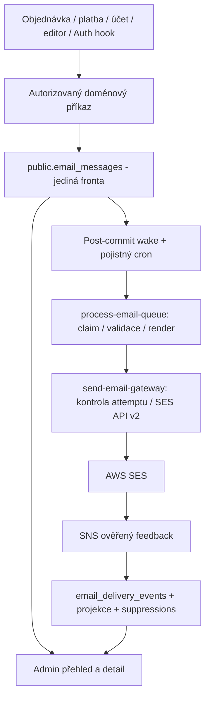

# Jedna e-mailová fronta, okamžité zpracování a AWS SES reporting

## Produkční dodatek 2026-10-04

Uživatel následně autorizoval skutečné e-maily, AWS nastavení, merge/push a úplné produkční nasazení. Společný backend je zapnutý a všech 11 schválených aktivních webů má verzi 0.20.83+567 s e-mailovým stavem v Orders. Důkazy a přesné commity jsou v [produkčním záznamu](canonical-email-delivery-PRODUCTION-2026-10-04.md).

Živá data odhalila historickou placenou objednávku s neplatnou adresou, kterou přísný enqueue původně odmítl. Migrace atomicky rollbackovala; opravený převod takové kandidáty zachovává jako unknown s původní adresou a chybou pro ruční řešení. Produkční PostgREST safeupdate také vyžaduje WHERE u singleton aktualizací a GoTrue nepovoluje HTTP hook mimo loopback. Následné kanonické migrace ochranu zachovávají, hook používá veřejný HTTPS API origin a stávající recovery obnovuje kvótu i při nečinné frontě. Tyto skutečnosti nahrazují původní provozní předpoklady níže.

Datum: 2026-10-03  
Stav: Návrh připravený pro implementaci; produkční inventura a nasazení neprovedeny  
Verification: standard - sdílené chování, souběh, autentizace, platby a migrace  
Podklad: Festapp `release/ticket-editor-ui-20261003`, HEAD `e380979aa`, včetně aktuálního pracovního stromu. Mendelio `/Users/miakh/source/roman_seznamka`, HEAD `4ecb7df41`.

Revize 2026-10-03: druhý průchod zahrnul závěrečnou obrazovku objednávky ve webu i Flutteru, lokalizace, změny splatnosti, odebrání platby, souběh ručního a automatického odeslání, životnost příloh a obnovu provider feedbacku. Jde stále o plán, nikoli implementaci.

## Výsledek a rozsah

Veškeré systémem odesílané e-maily Festapp projdou jednou trvalou frontou a jedním poskytovatelským odesílačem přes AWS SES API v2. Patří sem objednávky, úhrady a zálohy, připomínky, vstupenky, ruční zprávy, registrace, přihlašovací kódy, Google mailbox ověření, reset hesla, odkazy na aplikaci a oznámení o mazání účtu. Prověřit a zahrnout také nativní Supabase Auth odesílání.

Objednávka uloží záměr odeslat ve stejné transakci jako svou změnu. Po commitu se zpracování probudí okamžitě; minutový cron zůstane jen pojistkou a plánovačem budoucích úloh. Uživatelský požadavek na objednávku nečeká na SES ani generování e-mailových příloh. Výjimkou zůstává existující obchodní podmínka dokončení Fakturoid platby.

Správce uvidí u zprávy stav fronty, převzetí SES, doručení poštovnímu serveru, odmítnutí, zpoždění, bounce, spamovou stížnost, pozorované otevření a kliknutí, historii pokusů a důvod neodeslání. Vznikne přehled za akci/organizaci a detail u objednávky či uživatele.

Rozsah nezahrnuje příchozí schránku, AI odpovědi, sociální sítě ani celý komunikační produkt Mendelio. Příchozí `bank-mail-parser` a OneSignal zůstávají samostatné schopnosti. Nemění se obchodní pravidla plateb ani frekvence zjišťování bankovních transakcí. Připravený e-mail lze odeslat ihned, neznámou bankovní platbu tím nelze zjistit dříve.

Nyní je autorizovaný pouze průzkum a plán. Žádné migrace, AWS změny, skutečné zprávy, commit, push ani deploy. Existující rozpracované změny reportů/UI se nesmí přepisovat. Implementace patří na větev z aktuálního `main`; tento podklad není pokyn přepnout či resetovat sdílený dirty checkout. Žádný automatický rollout dalších `prod/*` variant.

## Zjištěný stav Festapp

| Fakt | Konkrétní důkaz | Důsledek |
|---|---|---|
| Jedna explicitní uložená fronta `public.queue_emails`, ale více způsobů odesílání | Baseline tabulka; `supabase/functions/send-email/index.ts` a přímí volající `deliverEmail` | Nestačí přejmenovat frontu nebo zrychlit cron |
| SMTP transport je již společný | `supabase/functions/_shared/emailDelivery.ts`: nodemailer, šablony/wrappers, `log_emails` | Zachovat renderovací pravidla; nahradit transport a zakázat přímé volání mimo worker |
| Fronta se probouzí po minutě | `database/functions/seed/crons.sql`; `automation/hetzner-supabase/runtime/finalize-canonical-database-operations.sh`: `festapp_canonical_process_email_queue` | Příčina plánovací prodlevy potvrzena v kódu, nikoliv živým měřením |
| Claim bere 25 zpráv, zamyká `SKIP LOCKED`, lease vyprší po 10 minutách; release pouze vrací úlohu | `claim_due_queue_emails_v1`, `release_queue_email_v1` v baseline a migraci `20260802234000_client_sync_v1_expansion.sql` | Chybí fencing token, backoff a rozlišení nejasného výsledku poskytovatele |
| Validace připomínek je oddělená od claimu a maže záznamy | `database/functions/emails/get_due_queue_emails.sql`; cron ji volá před workerem | Okamžitý worker nesmí tuto validaci obejít |
| Potvrzení objednávky je transakční a command-idempotentní | `enqueue_ticket_order_confirmation_v1`, create/replace client-sync RPC; `send-ticket-order/index.ts` vrací `delivery: queued` | Zachovat command receipt a snapshot objednávky |
| Fakturoid blokuje potvrzení do dokončení platby | `20260924140000_gate_fakturoid_order_completion.sql`: `target_time=infinity`, `complete_fakturoid_ticket_order_v1`, `abort_fakturoid_ticket_order_v1` | Probuzení při insertu nestačí; budit i při odblokování. Nepoužívat starší definici z baseline |
| Vstupenky mají implicitní druhou frontu | `get_orders_for_ticket_sending.sql`: `state=paid`; `synchronize-orders/index.ts` část 2 volá `send-tickets`; cron bankovní synchronizace po 10 minutách | Záměr vstupenek vytvářet při doménové změně, odstranit odesílací sken |
| Stejný template code dnes znamená dvě odlišné operace | `getTicketOrderPaidTemplate.ts` a `send-tickets/index.ts` používají `TICKET_ORDER_PAYMENT_DONE` | `message_kind` oddělit od template code; neztratit zálohové informace ani PDF |
| Dokončení po odeslání může selhat | Mazání fronty v `send-email`; změna stavu v `send-tickets`; `markSent` v `appLinksDelivery.ts` | Oprava evidence nesmí opakovat úspěšné odeslání |
| `log_emails` eviduje lokální odeslání, ne doručení | `_shared/emailDelivery.ts`: insert po SMTP, neukládá provider MessageId | Historické záznamy nelze zpětně prohlásit za doručené |
| Klienti závisí na stavu odesláno | `lib/data_services/auth_service.dart`: `status == sent`; `account_deletion_service.dart`: `email_sent` | Zachovat staré veřejné kontrakty pomocí tenké hranice nebo explicitně sjednat jejich verzi |
| Závěr objednávky slibuje minutové doručení a nerozlišuje queued/accepted | `assets/translations/{cs,en}.json`: `PublicOrder.paymentInfo*`/`confirmationInfo*`; web `order_result.js`, Flutter `order_finish_screen.dart` | Upravit obě UI, všechny varianty textu i skutečný delivery stav; nepřepsat jen českou větu |
| Odebrání úhrady vrací paid objednávku do ordered | `database/functions/eshop_orders/recalculate_order_payment_status.sql` | Zrušit dosud neodeslané zastaralé payment/ticket intent, neodesílat podle starého snapshotu |
| Přepočet připomínek dnes maže a znovu vkládá úlohy | `set_payment_deadline.sql`, `queue_payment_reminders.sql` | Po přidání auditu nelze zachovat plošný DELETE; je nutná verze a řízené cancelled/superseded |

Další konkrétní producenti:

- SQL: `create_ticket_order.sql`, `update_order_and_tickets_to_paid.sql`, `queue_payment_reminders.sql`, `set_payment_deadline.sql`; volající `update_form.sql` a `update_occasion.sql`; zrušení při `delete_occasion.sql` a Fakturoid abortu.
- Edge: `send-email` single mode, `send-tickets`, `send-custom-email`, `register`, `send-sign-in-code`, `send-reset-password-link`, `send-app-links`, `request-account-deletion`, `confirm-account-deletion`, `_shared/googleAuthFlow.ts` větev `mailbox_send`.
- Flutter hranice: `db_eshop.dart`, `db_orders.dart`, `db_tickets.dart`, `auth_service.dart`, `account_deletion_service.dart` a jejich uživatelské potvrzovací hlášky. Registraci ve webu/Flutteru dohledat podle jmen těchto konkrétních endpointů.
- SQL zdroje nejsou úplně vytaženy z baseline: claim/release a command enqueue je nutné při implementaci přidat do `database/functions/emails/` jako aktuální kanonické definice a dodat nové migrace; historické migrace nepřepisovat.

## Co přesně přebíráme z Mendelio

Ověřený zdroj je místní platformní repozitář `roman_seznamka`, nikoliv `mendelionet-sdk`.

| Vzor | Zdroj relativně ke kořeni Mendelio | Převzetí do Festapp |
|---|---|---|
| Typovaný záměr + idempotency key + jedna fyzická doručovací fronta | `supabase/db-functions/communications/enqueue_outbound_message_internal.sql`, `docs/runbooks/unified-notification-delivery.md` | Jeden vlastní Festapp kontrakt a fronta; žádná závislost na databázi Mendelio |
| Jediná provider gateway | `_shared/email-gateway.ts`, `send-email-gateway/index.ts` pod `supabase/functions/` | Oddělený interní gateway endpoint a jediné místo s oprávněním SES send |
| AWS SES v2, konfigurace a tagy, provider MessageId | `supabase/functions/_shared/ses.ts`, `packages/communications/contracts/email-sender-registry.json` | Sender registry Festapp, config sety a korelační tagy; nevkládat automaticky sdílené Mendelio credentials/config sety |
| Claim, rozhodnutí, begin, complete/fail; nejasný provider výsledek bez automatického retry | `supabase/functions/_shared/notification-email-dispatcher.ts` | Fencované leases a samostatná fáze odeslání |
| Delivery/open/bounce/complaint, deduplikace a suppressions | `supabase/functions/tutoring-notification-provider-events/provider-events.ts`, `supabase/db-functions/communications/email_provider_event_record.sql` | Provider event journal a suppression; rozšířit o click, delay, reject a rendering failure |
| Admin analytics | `apps/communications/src/app/api/delivery-analytics/route.ts`, `supabase/db-functions/tutoring/email_admin_analytics.sql` | Nativní Flutter přehled s tenant oprávněními, nepřenášet Next UI |

Hranice shody: Mendelio runbook popisuje minutový delivery timer a SQS polling provider událostí. To není důkaz okamžitého doručování v Mendelio. Festapp přidá explicitní post-commit wake. Pro provider feedback zvolíme samostatný SNS HTTPS ingress s ověřením podpisu, protože Festapp už takovou hranici má pro bankovní poštu. Události budou trvale uloženy před potvrzením SNS; nejde o druhou frontu odesílání. Pokud infrastruktura vyžaduje existující SQS transport, nahradit pouze ingress adaptér a zaznamenat rozhodnutí, nikoli vytvářet druhý provider event model.

Mendelio zkoumaný parser zpracovává delivery, permanent bounce, complaint a open; samotné SES click události v něm nejsou. Sledování kliknutí je tedy explicitní rozšíření Festapp, ne tvrzení o již existující úplné shodě. Registry Mendelio již obsahuje identitu `info@festapp.net`; neprokazuje to vlastnictví/region/aktivní konfiguraci AWS pro tento backend.

## Cílová architektura

### Vlastnictví a kontrakt

- `public.email_messages` je jediný trvalý rozvrh odesílání, rozšířený o auditní stav. V migraci přejmenovat existující `queue_emails`, zachovat její primární klíče a přidat `message_id uuid` pro korelaci. Žádné dlouhodobé dvojí zápisy.
- `public.enqueue_email` je interní zapisovací hranice. Vstupy: serverem odvozený tenant/context, typ zprávy, recipient snapshot nebo řízený resolver, doménové reference/verze, bezpečný payload, `dedupe_key`, `not_before`, případná expirace a priorita. Výstup `{message_id, state, replayed}`. Stejný klíč a stejný vstup vrací stejnou zprávu; kolize odlišného payloadu je chyba. Obecný enqueue není veřejné anonymní RPC.
- Registry typů určuje renderer, template code, oprávnění, recipient policy, priority, tracking policy, expiraci a idempotentní post-action. Doménové příkazy určují co poslat; klient si nesmí vybrat libovolný tenant, sender, přílohovou URL nebo interní typ.
- Jediný worker `process-email-queue` claimuje frontu a připravuje obsah. Jediný gateway `send-email-gateway` smí volat SES. Gateway ověří aktuální lease a jednorázově přepne attempt do `sending`; opakování HTTP požadavku se stejným attemptem už nevolá SES.
- `emailDelivery.ts` rozdělit na čistý renderer a provider adaptér. Zachovat dědění occasion -> unit -> organization, wrapper, jazyk/tón, Reply-To, QR, PDF a skutečné From v auditu. SES adaptér je dostupný pouze gateway.
- `email_attempts` eviduje přípravu a jednotlivé provider pokusy; `email_delivery_events` je append-only evidence feedbacku; `email_suppressions` blokuje adresy po hard bounce/complaint. Tyto tabulky nejsou alternativní fronty.
- `log_emails` zachovat pouze jako historický archiv bez nových zápisů; report může sjednotit historické souhrny s novými, ale historické doručení/otevření musí být `unknown`.

### Architektonická efektivita

Implementovat jako jednu e-mailovou schopnost s jasnými hranicemi, ne obecnou platformu pro všechny background joby. Podrobný plán popisuje požadované chování; neznamená jeden nový service, tabulku, timer nebo RPC pro každou odrážku.

- Využít stávající PostgreSQL, pg_net, Function deployment a privátní úložiště příloh. Nezavádět Redis, Kafka, další odchozí broker ani nový univerzální orchestration framework. SNS a případný dead-letter cíl slouží pouze příchozím provider událostem.
- Jeden vlastník doménového stavu v SQL, jeden worker dispatcher s typovanou mapou rendererů, jeden provider gateway a jeden feedback adaptér. Registry je malý explicitní kontrakt známých typů zpráv, nikoliv dynamický plugin systém nebo obecný workflow jazyk. Renderery znovu používají existující šablony, PDF, QR a Fakturoid kód.
- Worker a gateway mají různé bezpečnostní odpovědnosti, ale nemají dvě implementace retry, limiteru ani auditu. Síťová hranice gateway je odůvodněna izolací SES oprávnění a centrální autoritou. Nepřidávat další proxy mezi ně a SES. Skutečnou izolaci runtime zvolit podle existujícího deploymentu s nejmenší nutnou provozní změnou.
- Spojit atomicky související DB kroky: claim a přípravná lease; permit a provider begin; accepted evidence a naplánování post-action; feedback insert a reporting projekce. Neprovádět sérii jemných HTTP RPC pro každý jednotlivý sloupec. Síťové služby ani rendering neběží pod DB zámkem. Detail RPC a indexů přizpůsobit konkrétním dotazům, ne spekulativnímu budoucímu provozu.
- Reporty čtou malé projekce a stránkovaný detail, ne celý event journal pro každý řádek. Přílohy vzniknou jednou pro daný snapshot, po úspěšné přípravě se znovu použijí. Wake se slučují a workery pracují v omezených dávkách; žádný nový polling mechanismus na každý tenant, objednávku nebo UI buňku.
- Zachovat jen potřebné veřejné adaptéry pro podporované klienty a historický audit. Odstranit nahrazenou business logiku, staré crony a transport ve stejném cutoveru. Neudržovat „pro jistotu“ dvě implementace a nenavrhovat kopii fronty pro každý projekt.
- Rozhodnutí o velikosti batch, paralelismu a dalších optimalizacích opírat o běžné provozní metriky a skutečnou AWS konfiguraci. Zákaz kapacitních/zátěžových testů platí. Nezavádět další cache nebo službu bez konkrétního doloženého problému; bezpečnost transakcí, tenant izolaci a ochranu před duplicitami nelze vynechat jako optimalizaci.

Tato pravidla jsou součástí všech implementačních vln. Při předání stručně uvést finální moduly a jejich odpovědnosti, nové provozní komponenty a odstraněné staré cesty. Každá další komponenta oproti tomuto návrhu musí mít konkrétní důvod v aktualizovaném plánu.

### Stavy a bezpečnost souběhu

Oddělit stav workflow (`blocked`, `pending`, `preparing`, `sending`, `accepted`, `retry_wait`, `unknown`, `dead`, `cancelled`, `suppressed`, `expired`) od provider událostí (`send`, `delivery`, `delay`, `bounce`, `complaint`, `reject`, `rendering_failure`, `open`, `click`). Převzetí API není doručení a otevření nesmí přepsat bounce ani complaint.

1. Claim používá `FOR UPDATE SKIP LOCKED`, omezený batch, `lease_token`, `lease_until`. Mutace/release/complete vyžadují aktuální token. Timeout renderu, SES i celého workeru je kratší než lease; delší rendering má omezený heartbeat. Neclaimovat 25 drahých PDF, když se do budgetu vejde jen několik.
2. Vypršelá lease v přípravě se může opakovat. Po přechodu `sending` se bez jistoty o výsledku nikdy automaticky nevrací do pending. Chyba uložení výsledku, timeout/rozpojení během SES a pád po sendu znamenají `unknown` s incidentem/reconciliation. SES SendEmail neposkytuje aplikační exactly-once klíč; Message-ID ani tag nejsou ochrana proti opakovanému sendu.
3. Retry se týká pouze prokazatelně nepřijatého pokusu: příprava, throttling a potvrzená přechodná chyba. Startovní politika 15 s, 60 s, 5 min, 30 min, 2 h s jitterem, nejvýše 8 pokusů a vždy před expirací; konkrétní HTTP/provider chyby klasifikovat testovanou allowlist. Trvalá chyba přejde do dead. Globální outage otevře circuit breaker, nikoli lavinu retry.
4. Po převzetí SES transakčně uložit provider MessageId a označit přijetí. Idempotentní post-actions mají vlastní stav v téže zprávě; jejich oprava už nevolá transport. Například označení vstupenek/objednávky, `mark_payment_reminder_sent`, history flags, app links a deletion-email state.
5. Připomínku znovu posoudit při claimu i těsně před provider begin: stav úhrady, verze deadline, příznaky formuláře, deposit/on-site a sedmidenní grace. Již neplatná zpráva skončí cancelled/expired, ne retry smyčkou. Platbu přijatou až po závěrečné kontrole nelze atomicky svázat s externím SES; audit uchová ověřenou verzi.
6. Fakturoid `blocked` lze odblokovat pouze dokončením správného commandu. Abort zruší zprávu. Starý `infinity` převést na blocked, ne na okamžitý send. Uvolněný snapshot musí obsahovat finální platební údaje.
7. Idempotency scope je tenant + typ + zdrojová událost/verze/příjemce. Automatická platba a tickety mají různé typy. Záměrné opětovné zaslání má nový explicitní request ID; retry stejného kliknutí stejný ID. Tombstone/dedupe metadata přežijí retenční smazání těla.
8. Priorita auth/objednávky a rezervovaná kapacita brání blokování za hromadnými PDF; aging a per-tenant limity brání vyhladovění. Celkový limit sendů platí přes všechny worker instance podle AWS kvót.
9. Pro tentýž příjemce/objednávku explicitně zachovat kauzální pořadí potvrzení a navazujících platebních/ticket zpráv. Pozdější zpráva nesmí přeskočit blokované potvrzení jen díky prioritě; po dead/unknown rozhodnout registry pravidlem a evidovat důvod. Ruční odeslání stejné aktuální sady vstupenek splní tentýž automatický delivery intent, pokud jde o stejného příjemce a verzi. Skutečný uživatelský resend a odeslání na jinou oprávněnou adresu jsou samostatné auditované záměry.
10. Změna splatnosti/feature/form nastavení ruší pouze dosud nezačaté příslušné reminders a vytváří novou verzi. Nevymazává accepted/unknown/attempt historii. Payment/ticket intent před begin kontroluje i odebrání či přepárování transakce; přechod paid -> ordered ruší zastaralý pending intent. Opětovné zaplacení má novou payment version, aby oprávněnou zprávu nezablokoval starý dedupe klíč.
11. Úspěšnou přípravu uložit jako neměnný snapshot s referencemi na privátní přílohy a hashi před provider begin. Retry stejné zprávy nesmí potichu změnit šablonu, cenu nebo sadu PDF. Selhání přípravy před dokončením lze znovu sestavit, ale doménovou platnost před sendem vždy ověřit. Blob reference musí být interní a tenant-bound, ne klientská URL; cleanup až po ukončení všech odkazujících pokusů a retenci. Nevystavovat přílohy veřejně a nepersistovat krátkodobé signed URL jako zdroj pro budoucí retry.

### Kapacitní řízení a přetížení

Upřesnění uživatele: autoritou je skutečná kvóta našeho AWS účtu, nikoli odhad nebo testováním hledaná propustnost. Uživatel uvádí aktuálních 14/s; při konfiguraci načíst autoritativní SES v2 `GetAccount.SendQuota` pro daný účet a region: `MaxSendRate`, `Max24HourSend`, `SentLast24Hours`. Nezavádět pevnou hodnotu 14 ani 10 do implementace. Toto je čtení konfigurace, nikoli zátěžový test. [AWS SendQuota](https://docs.aws.amazon.com/ses/latest/APIReference-V2/API_SendQuota.html).

**Výchozí politika:** odesílat nejvýše 80 % skutečného `MaxSendRate`, případně méně podle přiděleného Festapp podílu ve sdíleném AWS účtu. Efektivní tempo je `0.8 * MaxSendRate` pro výhradní Festapp účet, při sdílení `min(0.8 * MaxSendRate, festapp_allocated_rate)`. Podporovat i necelé tempo plynulým rozestupem sendů, nezaokrouhlovat nahoru. Rezerva je centrální provozní nastavení, ne volba tenanta.

**Rozsah pravidla je celý Festapp:** všechny organizace, akce, projekty, frontendové varianty, typy zpráv, automatické i ruční odesílání, auth, opakované pokusy a všechny instance workerů spotřebovávají tentýž společný rozpočet pro příslušný AWS účet/region. Nová organizace ani projekt nezískává vlastní kopii limitu. Rozdělení práce mezi tenanty je jen férové přidělování uvnitř této společné kapacity. Ani samostatně nasazený Festapp projekt nesmí obejít centrální gateway/limiter vlastními AWS send credentials; pokud existuje oddělená DB projektu, stále používá stejnou centrální odesílací autoritu. To je požadavek na architekturu všech Festapp projektů, nikoli autorizace nyní nasadit všechny produkční větve.

**Bez testování kapacity:** na výslovný pokyn uživatele neprovádět zátěžové či kapacitní testy, syntetické dávky ani pokusy zjistit kvótu odesíláním zpráv. Původní scénář 1000 zpráv se ruší, včetně stub varianty. Toto omezení nepřepisovat doporučením testovacího runneru. Běžné kontroly ostatní funkčnosti zůstávají v rozsahu plánu; správnost limitu opřít o autoritativní konfiguraci a jedinou sdílenou implementaci bez bypassů.

- **Jedno sdílené hradlo:** krátká atomická DB operace před provider begin přidělí send permit podle account/region rozpočtu. Zohlední všechny gateway/worker instance, cron i okamžité wake a případné retry. Paměťový limiter v každé instanci nestačí. Plynulé dávkování bez nahromaděných burst kreditů po výpadku; žádné předem přidělené budoucí sloty, které pak pomalé workery odešlou současně. Permit je krátce platný a vázaný na attempt; propadlý se znovu získá. Zámek nečeká na síť, rendering ani sleep.
- **Sdílený účet s Mendelio:** Festapp limiter sám neřídí cizí aplikaci. Před aktivací zajistit buď koordinovaný společný account budget, nebo výslovně rozdělené rychlostní i denní rozpočty všech senderů s celkovou rezervou. Bez tohoto důkazu nelze tvrdit globální ochranu účtu; konzervativně neaktivovat send podle plné AWS kvóty. Nepřidávat runtime závislost na Mendelio DB jako náhodný fallback.
- **Denní limit:** hlídat i klouzavých 24 hodin, nikoli půlnoc. Držet 10% rezervu pod přiděleným denním limitem; započítat accepted/unknown a rozpracované rezervace, odmítnuté prokazatelně nepřijaté pokusy uvolnit. Provider snapshot kombinovat s novější lokální evidencí konzervativně, bez podhodnocení rozpracovaných sendů. Kvóty načíst při startu a nejvýše jednou za 5 minut sdíleným refreshem, ne pro každý e-mail. Po 15 minutách bez spolehlivého snapshotu pozastavit nové provider begin a vyhlásit incident; durable enqueue funguje dál. Nedostatek denní kvóty vede k odkladu a periodickému přehodnocení, ne k rychlým retry ani nové zprávě.
- **Fronta absorbuje špičku:** nedostatek permitu vrací `next_eligible_at`, zpráva bezpečně zůstane v jediné DB frontě. Čekání na kapacitu nezvyšuje počet neúspěšných provider pokusů a nezpůsobí dead po osmi běžných odkladech. Claimovat jen tolik práce, kolik se vejde do kapacity a runtime budgetu; delší odklad uvolní přípravnou lease. Krátké dávkování může probíhat uvnitř omezeného běhu, po jeho skončení canonical pokračování; žádná minuta pauzy mezi každými deseti e-maily, žádný HTTP wake na každé čekající položce.
- **Chránit i CPU/paměť:** samostatný globální limit paralelní přípravy PDF/příloh, výchozí 2 náročné úlohy a 2 souběžné SES requesty, konfigurovatelné podle měření. Tempo odvozené z AWS kvóty je strop, nikoli povinnost zahltit systém pro dosažení rychlosti. Horní meze příloh, bounded batch a souhrnné wake zabraňují neomezenému počtu rendererů nebo Edge instancí při růstu fronty. Tyto semafory mají vlastní expirující leases; nejsou další delivery queue.
- **Priorita a férovost:** rezervovat průběžně část permitů a lehké přípravné kapacity pro auth/nové objednávky. Nevyužitou rezervu může spotřebovat běžná práce, ale bez předrezervování dlouhé řady bulk sendů. FIFO uvnitř priority/tenantu, aging pro čekající méně naléhavé zprávy a per-tenant podíl. Expirující přihlašovací kód nesmí čekat za stovkami PDF, ale ani jiný tenant nesmí zůstat trvale bez obsluhy.
- **Reakce na throttling:** známý provider throttle sníží společné efektivní tempo (například na polovinu), aplikuje jitter/backoff a po stabilním období se pomalu vrací pod stanovený strop. Žádná okamžitá retry smyčka. Rozlišit throttle od ambiguous transport chyby; unknown se neodesílá znovu. Globální provider outage otevře circuit breaker s omezeným probe, frontu zachová.
- **Plná fronta není úspěšně odeslaná zpráva:** úspěšná objednávka vyžaduje durable zápis intentu, nikoli dostupnost SES. Selhání samotného DB/outbox zápisu musí selhat spolu s transakcí; zprávy se při přetížení nesmí tiše zahazovat. Před vyčerpáním DB/storage mít alert a bounded příjem bulk požadavků; nevracet success producentovi, jehož záměr se nepodařilo uložit. Zákaznické UI dál rozlišuje objednávku a queued/accepted stav e-mailu.

Do provozního přehledu přidat efektivní limit, přidělený/account budget, využití za 24 h, počet capacity-deferred zpráv a nejstarší čekající úlohu. Čas vyprázdnění backlogu zobrazit jen jako odhad z aktuální propustnosti, ne slib. Rychlostní cíle 2/5 sekund platí pro běžný provoz s volnou kapacitou; při špičce platí bezpečné čekání, priority a viditelný důvod prodlevy.

### Okamžité probuzení

`enqueue_email` a operace, která zprávu odblokuje, explicitně zavolají interní `wake_email_worker`. Ta naplánuje `net.http_post` na kanonický endpoint v aktuální transakci, s krátkodobým interním oprávněním a pevným URL. `pg_net` zahájí HTTP až po commitu. Žádný persistentní aplikační trigger a žádná závislost na browseru nebo nečekaném background promise. [Dokumentace pg_net](https://supabase.com/docs/guides/database/extensions/pg_net).

Wake je pouze nápověda. Jeho selhání nesmí rollbackovat již uložitelnou objednávku; chybu zaznamenat a obnovu zajistí jediný pojistný cron nad stejnou frontou. Coalescing omezí wake jednou za transakci/burst, nesmí držet globální zámek po celou objednávku ani způsobit ztracené probuzení. Budoucí reminder se neodesílá před `not_before`; cron jej probudí v termínu. Worker po dávce s další splatnou prací naplánuje pokračování, nečeká na další minutu.

Cíl k ověření v canary: běžná splatná objednávka bez vnějšího blokování začne zpracování v p95 do 2 s od commitu; jednoduché potvrzení předá SES v p95 do 5 s. Jsou to akceptační cíle, ne naměřené hodnoty ani příslib doručení do schránky. PDF/Fakturoid mají samostatnou metriku přípravy. Ztracený wake zachytí cron do jednoho intervalu plus doba zpracování.

### Hláška po dokončení objednávky

Odstranit „obvykle do minuty“ i anglické „usually within a few minutes“ ze všech variant `PublicOrder.paymentInfo`, `paymentInfoWithEmail`, `confirmationInfo`, `confirmationInfoWithEmail`, včetně `_informal`. Konkrétní místa: `assets/translations/{cs,en}.json`, jejich distribuované kopie `web_client/public/assets/translations/`, `web_client/src/components/forms/{public_order_strings,order_result}.js`, `lib/components/forms/public_order_strings.dart` a `lib/components/forms/views/order_finish_screen.dart`. Ověřit také fallback klíčů v de/sk/pl/uk, aby se neobjevil starý časový příslib nebo holý klíč. Respektovat aktuální cizí změny překladů; nezapisovat celé soubory z historické verze.

Navržené texty pro zaplacenou/neplacenou objednávku:

| Stav potvrzení | Varianta s platebními údaji | Varianta bez platby |
|---|---|---|
| queued/preparing | „Děkujeme! Platební údaje najdete níže. Potvrzení a platební údaje právě odesíláme na {email}.“ | „Děkujeme! Potvrzení právě odesíláme na {email}.“ |
| accepted/delivered | „Děkujeme! Potvrzení a platební údaje jsme odeslali na {email}. Platební údaje najdete také níže.“ | „Děkujeme! Potvrzení jsme odeslali na {email}.“ |
| retry_wait/unknown/dead/suppressed nebo pozdější bounce/reject | „Objednávka je dokončena. E-mail se zatím nepodařilo potvrdit jako doručený. Platební údaje najdete níže.“ | „Objednávka je dokončena. Stav odeslání potvrzení zatím není potvrzen.“ |

Chybové texty při implementaci zpřesnit podle známého důvodu: jasné neodeslání, zpoždění a unknown nejsou totéž. Nikdy zobrazovat chybu celé objednávky ani vybízet k jejímu novému založení jen kvůli e-mailu. Formální/neformální varianty použijí Vám/ti nebo odpovídající slovesný tvar; bez dostupné adresy použít „e-mailem“. U Flutteru nejprve odstranit současný předpoklad, že každá úspěšná objednávka má platební údaje pod textem; větu „najdete níže“ použít jen tam, kde je UI skutečně vykresluje.

Nový klient nejprve ukáže queued text ihned s úspěchem objednávky a QR. Pro přechod na „odeslali jsme“ přidat úzce omezené read-only čtení stavu potvrzení, nikoli čekání na SES uvnitř checkout požadavku. `send-ticket-order` může novým klientům aditivně vrátit neprůhlednou receipt capability, která čte pouze coarse delivery stav jediné confirmation zprávy. Samotné order ID, command UUID, e-mail ani message ID nejsou oprávnění. Capability je kryptograficky náhodná, v DB pouze hash, krátce platná, bez tokenu v URL/logu; žádná práva k payloadu, jiným zprávám nebo retry. Existující autorizované receipt čtení lze znovu použít pouze pokud prokazatelně splňuje stejnou hranici; nevytvářet duplicitní business stav.

Po zobrazení výsledku provést nejvýše 5 dotazů během 15 sekund, pozastavit v neviditelné stránce a ukončit při zavření/dispose; endpoint rate-limitovat a vracet no-store. Selhání status čtení ponechá úspěch objednávky a bezpečný queued text, ne „odesláno“. Bez uvedené bezpečné receipt hranice ponechat pouze „právě odesíláme“, nepřidávat veřejné lookup RPC. Stav se týká potvrzení objednávky, ne samostatných pozdějších vstupenek. Historický fallback backend bez status capability musí dál fungovat.

### AWS SES a feedback

- Nový Festapp sender/config registry, oddělené bezpečnostní a transakční konfigurace, API credentials s minimálním `ses:SendEmail` rozsahem pro schválené identity. Worker/producenti nemají SES klíče. Pokud Edge runtime sdílí globální env, gateway musí mít skutečně oddělený runtime/secret injection nebo se toto omezení nesmí vykazovat jako splněné.
- Před produkční aktivací ověřit AWS účet/region, SES production access, limity, sender identity, DKIM, SPF/custom MAIL FROM, DMARC, tracking HTTPS doménu a event destinations. Existující Mendelio sender záznam není oprávnění měnit jeho infrastrukturu.
- V každém sendu config set + neosobní tagy `message_id`, `attempt_id`, `message_kind`, scope. Uložit SES MessageId a konfiguraci. Nenahrávat e-mail, token nebo obsah objednávky do tagů.
- Zachovat libovolný legitimní počet vstupenek v příloze. Nekopírovat Mendelio limit tří příloh. Omezit celkovou MIME velikost před API podle SES a runtime paměti; nikdy neodeslat neúplné PDF. Pro nadlimitní objednávku definovat jasnou chybu/operátorský postup, nikoliv tiché vynechání. SES v2 podporuje přílohy; celkový současný limit je 40 MB. [AWS attachments](https://docs.aws.amazon.com/ses/latest/dg/attachments.html).
- `email-provider-events` přijímá pouze schválené SNS topic ARN/account/region, ověřený podpis a HTTPS certifikát bez redirect/SSRF. Zobecnit již testovaný `bank-mail-parser/snsVerification.ts` do `_shared`, zachovat oddělené allowlisty topiců. Potvrzení subscription teprve po ověření a pro přesný topic. [AWS SNS ověřování](https://docs.aws.amazon.com/sns/latest/dg/sns-verify-signature-of-message.html).
- SNS odpověď 2xx až po durable insertu. Duplicitní událost je bezpečný success. Unmatched událost uchovat pro opětovné spárování; feedback může přijít dříve než zápis API odpovědi. Korelace přes provider MessageId i vlastní tag attemptu. Tag sám nestačí pro důvěru bez ověřeného ingressu a shody příjemce/scope.
- Pro nedostupný SNS ingress nakonfigurovat retry a dead-letter cíl s alarmem a řízeným replay ověřených událostí. Je to záchrana příchozího feedbacku, ne další fronta odchozí pošty. Testovat výpadek DB, dlouhý výpadek ingressu a replay. Chybějící event destination/config set nebo dlouhý feedback lag musí být incident, nikoli tiché „nedošlo“.
- Ukládat provider čas i čas přijetí; dedupe klíč topic + event ID + recipient + typ. Pořadí událostí nesmí snižovat známý stav. Evidence Send/Delivery může napravit unknown attempt bez dalšího sendu; absence feedbacku nepotvrzuje selhání.
- Hard bounce a complaint blokují další odesílání na danou adresu v rámci vlastní poskytovatelské identity. Soft bounce/delivery delay nepovažovat za důvod znovu odeslat tentýž již přijatý e-mail - retry doručování dělá SES. Smazání suppression jen auditovaným oprávněným postupem po nápravě.
- Tracking policy je per kind: objednávky a provozní zprávy mají open/click; citlivé jednorázové auth/reset/deletion odkazy standardně bez click rewrite a engagement pixelu. Dostupnost funkce tím nezmizí, ale tajné tokeny nesmí končit v provider URL metadatech nebo reportech. Report rozliší `tracking_disabled` a `not_observed`.
- Tracking policy nelze odvozovat pouze z názvu e-mailu: i order/PDF odkaz může obsahovat bearer token. Renderer označí citlivé odkazy a zvolená SES konfigurace nesmí jejich cíl posílat do click auditu; pokud nelze bezpečně vyloučit konkrétní odkaz, vypnout click tracking pro danou zprávu. GET/otevření skenerem nesmí potvrdit platbu, smazání účtu ani spotřebovat jednorázovou doménovou akci.
- Open/Click znamená událost pixelu/odkazu, může pocházet z proxy či skeneru. Bez události neříkat „neotevřeno“. Delivery znamená přijetí serverem, ne umístění v inboxu. API failure, nedoručitelnost a chybějící feedback jsou samostatné stavy. [AWS event typy a payloady](https://docs.aws.amazon.com/ses/latest/dg/event-publishing-retrieving-sns-examples.html).

### Auth, oprávnění a data

Všechna SQL RPC jsou v `public`, SECURITY DEFINER má `search_path = public, extensions`, explicitní oprávnění a kvalifikované `eshop.*`. Enqueue/claim/complete/feedback mají oddělené interní schopnosti; anonym ani běžný uživatel nesmí číst payloady nebo spouštět worker. Admin čtení ověřuje organization/unit/occasion a roli, nikoli jen klientský filtr.

Kontroly oprávnění se přesouvají před enqueue, ne až do rendereru. Dlouho žijící úloha neukládá bearer token člověka. Worker čte data na základě uloženého autorizovaného kontextu a interní identity. Ověřit zrušený účet, změnu doručovací adresy a odebrané oprávnění podle registry typu před sendem.

SQL změnu reset tokenu/mailbox challenge/deletion requestu spojit s enqueue do stejného doménového RPC. Tam, kde je zapojen externí Supabase Auth Admin API, použít trvalý command/phase s idempotentním dokončením, nikoliv předstírat transakci přes síť. Fronta nesmí generovat nový kód při retry; stará challenge expirovaná nebo nahrazená novou je zrušena. Citlivé payloady uložit šifrovaně s klíčem mimo DB, ne do logů, a smazat po terminálním stavu/expiraci. Po smazání účtu completion zpráva používá minimální email snapshot bez FK vyžadující existující účet; neumožnit cascade smazat neodeslané oprávněné dokončení.

Inventura nativního GoTrue SMTP je povinná. Pokud může emitovat, připojit ověřený Send Email Hook jako enqueue adaptér, po durable zápisu potvrdit hook a vypnout přímé SMTP. Pokud pinned runtime hook nepodporuje, je upgrade explicitní blokátor úplného cutoveru. Nezařazovat Auth tiše mimo rozsah. [Supabase self-hosted Auth hooks](https://supabase.com/docs/guides/self-hosting/self-hosted-auth-hooks).

Staré mobilní klienty mohou volat `send-email`/`send-tickets` i po nasazení. Tyto názvy proto zůstanou tenkými autentizovanými adaptéry ke stejné frontě. U kontraktů slibujících `sent`/`email_sent` adaptér po enqueue omezeně vyčká na canonical stav; úspěch vrátí jen po accepted. Při timeoutu vrátí stávající chybu, ale další pokus musí navázat na stejný command, ne vytvořit nový send. Nové klienty lze naučit `queued` přes explicitní capability/kontrakt, starým změnu nevnutit. Testovat i automatické retry a auth cooldown.

### Reporting a provoz

Nová komponenta `lib/components/email_delivery/` a SQL `get_email_delivery_page`/`get_email_delivery_detail` nabídnou keyset stránkování, filtr času, akce, typu a stavu, detail attempts/events a odkaz z objednávky/uživatele. Žádné zobrazení tokenů nebo plošné čtení PII. Souhrny oddělují počet zpráv od počtu událostí: první/poslední open/click, unique opened/clicked messages, delivered/bounced/complained, queued/dead/unknown/suppressed. Jmenovatel a tracking coverage musí být viditelné.

#### Vizuální stav e-mailů přímo v seznamu objednávek

Do tabulky objednávek přidat kompaktní sloupec **E-mail** jako poslední stavový sloupec před transakcemi a historií. Aktuální seznam sloupců vlastní `lib/components/eshop/views/orders_content.dart`, renderery `lib/components/eshop/eshop_columns.dart` (`TrinaColumn`); `orders_tab.dart` je pouze obal záložek. Použít společný widget z `email_delivery`, aby tabulka a detail vykládaly stejný stav stejně. Nepřetěžovat existující sloupec s adresou ani obchodní stav objednávky.

Buňka obsahuje jednu rozpoznatelnou ikonu, případně malý počet zpráv vyžadujících pozornost. Barva je podpůrná, nikdy jediný nositel informace. Nevkládat do každého řádku dlouhé texty nebo trvale animovaný spinner. Orientační mapování:

| Situace | Vizuální význam | Vysvětlení |
|---|---|---|
| Žádná evidence / historická objednávka | Neutrální obálka nebo pomlčka | „Stav e-mailu není k dispozici“, nikoli „neodesláno“ |
| Čeká / připravuje se / plánováno | Obálka s hodinami | Rozlišit „Odesíláme potvrzení“ a „Připomínka naplánována na…“ |
| SES accepted | Obálka se značkou odeslání | „Odesláno. Doručení zatím nepotvrzeno.“ |
| Delivery | Obálka se zaškrtnutím | „Doručeno poštovnímu serveru příjemce“ + čas |
| Open / click pozorováno | Otevřená obálka / příslušný indikátor | „Zaznamenáno otevření/kliknutí“ + čas; bez tvrzení o přečtení člověkem |
| Retry / unknown / dead / bounce / complaint / suppression | Varovná obálka | Konkrétní lidské vysvětlení zpoždění, nejistoty či selhání |

Objednávka může mít potvrzení, úhradu, vstupenky a několik připomínek. Proto buňka nesmí slepě ukazovat poslední event napříč zprávami: jinak pozdější úspěšná připomínka schová nedoručené vstupenky. Deterministický souhrn: nejprve nevyřešený problém aktivního delivery intentu, potom právě splatná nevyřízená zpráva, jinak výsledek nejnovější relevantní zprávy podle vytvoření záměru. Pozdější open staršího e-mailu nesmí přepnout výběr. Budoucí připomínka nesnižuje stav již doručeného potvrzení; pokud žádná jiná zpráva není, ukáže se plánování. Expired/cancelled záměry a vyřešené historické pokusy jsou pouze v historii. U více zpráv tooltip výslovně pojmenuje, ke kterému typu se ikona vztahuje a zda existuje další problém. Tento výběr počítá canonical reporting projekce, ne samostatná heuristika v Dart.

Interakce:

- **Hover a fokus klávesnice:** krátký tooltip, například „Potvrzení objednávky: doručeno dnes v 14:32. Vstupenky: čekají na odeslání.“ Lokalizovat čas podle UI. Při neaktuálních datech doplnit čas posledního načtení.
- **Klepnutí/kliknutí, Enter nebo Space:** otevřít malé vysvětlení/popover; na úzkém displeji bottom sheet se stejným obsahem. Zobrazit stav jednotlivých typů zpráv, časy a tlačítko „Historie e-mailů“ do již plánovaného detailu. Klepnutí má fungovat přímo, ne pouze dlouhým podržením tooltipu. Nevyvolat současně kliknutí na řádek objednávky.
- Ikona má přístupný text a alespoň běžný dotykový cíl 48 x 48 logických pixelů; tooltip není jedinou dostupnou informací. Na malé šířce zachovat kompaktní sloupec v existujícím scrollu tabulky, nevynucovat široké slovní badge. Pokud seznam používá mobilní kartu, tentýž widget patří k metadatům karty.
- Tato interakce pouze vysvětluje stav. Neodesílá nový e-mail ani neprovádí retry; případná oprávněná resend akce zůstává explicitně v detailu a podléhá pravidlům unknown/dedupe.

Datová cesta: `DbOrders.getOrdersTabData` dnes čte `get_orders_tab_data`; přidat aditivní kompaktní delivery summary keyed by order ID do tohoto bundle a odpovídajícího modelu/mapování. Žádný request na každý řádek, žádná kompletní historie v seznamovém payloadu, žádné osobní auth zprávy přimíchané jen podle adresy. Vazba je tenant + konkrétní order ID/doménový intent. Dotaz agregovat nad vybranými objednávkami s vhodným indexem. Detail dotahovat až při interakci s kontrolou stejných oprávnění. Obnovení tabulky a již existující refresh znovu načtou souhrn; nepřidávat timer pro každý řádek. Případnou invalidaci sjednotit na úrovni seznamu, offline/stará data označit jako naposledy známá. Starší backend bez nového pole zobrazí neutrální neznámý stav.

Úvodní retenční politika: citlivé auth tělo do expirace/terminálního stavu, ostatní připravené tělo a přílohy 30 dní, normalizované doručovací události 90 dní, audit bez těla a dedupe tombstone 365 dní; minimální suppression do oprávněného odstranění. Hodnoty jsou rozhodnutí návrhu, před aktivací sladit s existujícím mazáním a provozními potřebami. Neukládat raw click query, IP a user-agent, pokud je report nepotřebuje. Retenční job není doručovací fronta.

Metriky: due age, commit-to-claim, preparation duration, ready-to-SES, depth per priority, retry/dead/unknown, heartbeat, SES throttle, feedback lag/unmatched a post-action backlog. Alerty nad oldest due, chybějícím heartbeat a provider incidenty. Pause zastaví nové provider begin, nikoli enqueue nebo feedback. Manuální retry dostupné jen pro known-not-accepted; unknown vyžaduje reconciliation. Žádný „poslat znovu vše“.

## Prováděcí vlny

### 1. Zafixovat kontrakty a konkrétní runtime inventuru

**Změny:** Dopsat registry typů a matici producent -> doménová transakce -> recipient -> dedupe -> renderer -> post-action. Výchozí seznam je výše. Zahrnout nulové objednávky, ruční hotovost, deposit/full payment, reaktivaci expired a změnu sync-enabled. Dohledat přímé zápisy `state=paid` a výběr `get_orders_for_ticket_sending`, aby žádný legitimní ticket send nezmizel.

Inventura musí výslovně zachytit i změnu adresy, odebrání/přepárování platby, souběh ručního/automatického sendu, více objednávek sdílejících payment_info, změnu splatnosti a vypnutí připomínek během lease. Doménové změny neprovádět druhou skrytou frontou. Pro bulk přepočty mít bounded enqueue, zachovat transakční vazbu a coalescing wake.

**Produkční read-only gate před nasazením:** Přes schválený backend-access postup ověřit activation, tenant mapping a identitu DB; inventarizovat cron.job, queue counts podle code/stavu, aktivní leases, dnešní pg_proc definice, nativní Auth config, deployed Functions a AWS resource metadata bez obsahu zpráv. Nepřistupovat k bývalému cloud projektu. Pokud DB je sdílená, zaznamenat dopad na všechny tenanty a oddělit backendovou koordinaci od nepovolených multi-tenant Flutter buildů.

**Validace/výstup:** Úplná matice všech uvedených cest, známé AWS identity a žádný nevyřešený zdroj odesílání. Živá inventura může být provedena až v implementaci/preflight; plán ji nevydává za hotovou. Rozhodnutí zde nemění data ani neposílá zprávy.

### 2. Durable kontrakt, gateway a feedback připravit bez aktivace sendů

**Změny:** Kanonické SQL v `database/functions/emails/`; nové číslované migrace pro rozšíření queue, attempts/events/suppressions a RPC. Připravit budoucí přejmenování, constraints/indexy/grants, registry a renderer. Implementovat SES gateway, provider event normalizer a reporting projekci. Aplikační SQL neumisťovat do jiných schémat podle Mendelio vzoru.

**Migrace:** Rozšíření nejprve kompatibilní s dosavadními řádky; nová pole mohou být před backfillem nullable, finální NOT NULL až po kontrole. Message/dedupe ID deterministicky z původního ID, command ID nebo jasné události. Neodvozovat z template code samotného. Historické logy nebackfillovat jako delivered.

**Selhání:** Oddělený start provider attemptu, zachycený provider MessageId a unknown cesta musí existovat před prvním sendem. Ověření SNS a persist-before-ack musí existovat před připojením topicu.

**Validace/výstup:** SQL test tenant isolation, konfliktní dedupe, grants; Deno fixture test SES request/response, přílohy, sender/Reply-To, gateway replay a SNS podpis/duplicate/out-of-order. Jeden platný attempt může získat send právo jen jednou, neautorizovaný request nemůže způsobit send ani podvrhnout report.

### 3. Worker a post-commit wake

**Změny:** `process-email-queue`, `wake_email_worker`, claim/decision/begin/complete/fail/reconcile RPC; bounded batch a globální rate limit. Přenést doménovou validaci z `get_due_queue_emails` do claim/decision. Přenést připomínkové post-actions. Zavést jediný pojistný cron v seed i canonical runtime setup.

Implementovat kapacitní kontrakt z předchozí sekce: jeden společný account/region limiter pro všechny organizace a projekty Festapp, tempo odvozené ze skutečné AWS kvóty s 20% rezervou, denní rozpočet, refresher, omezení paralelních rendererů/sendů a odklad bez spotřeby retry pokusu. Čtení SES kvóty má vlastní omezené IAM oprávnění; neotevřít ho klientům. Při sdílení AWS účtu je přidělený Festapp rozpočet povinný preflight údaj.

**Migrace/mazání:** Nový worker zatím pozastavený. Žádné souběžné staré a nové claimování. Starý `processQueue` mód bude při cutoveru nahrazen tenkým interním voláním stejného workeru nebo odstraněn po odstranění všech registrací.

**Selhání:** Testovat pád po enqueue/commit, ztrátu wake, souběh cron+immediate wake, lease expiry před i po begin, stale completion, runtime deadline, SES throttling a chybu DB po přijetí.

**Validace/výstup:** Integrační lokální pg_net + stub provider prokazuje send až po commitu, žádný při rollbacku, bez minutového čekání. Stub doručení bez SMTP. Ztracené wake recoveruje cron; unknown nikdy samo neodešle podruhé.

Kapacitní ani zátěžový test nespouštět, ani se stub providerem. Při implementaci doložit, že všechny Festapp organizace a projekty používají stejný limiter, žádná odesílací cesta jej neobchází a konfigurace vychází ze skutečné kvóty účtu. Ke stanovení limitu neodesílat zkušební zprávy.

### 4. Převést objednávky, platby a vstupenky

**Změny:** `enqueue_ticket_order_confirmation_v1` deleguje na kanonický enqueue; interní nový název může být bez suffixu, ale public client-sync protokoly `_v1` zůstávají. `complete_fakturoid_ticket_order_v1` odblokuje a budí; abort ruší. SQL order/payment transition vytváří ticket intent ve stejné transakci, včetně zero-price cest a všech kandidátů dnešního paid skenu.

`send-tickets` přesune rendering do registry workeru, zůstane autorizovaným enqueue adaptérem pro mobilní klienty. `send-email` single mode a `send-custom-email` obdobně. Odstranit část 2 `synchronize-orders`, zachovat bankovní sync. `get_orders_for_ticket_sending` použít jednorázově při cutover backfillu, potom odstranit jako delivery discovery cestu. Při zapnutí synchronizace akce jednorázově explicitně zařadit dosud způsobilé objednávky idempotentně.

**Chování:** Oddělit `order_payment_notice` a `order_tickets` od společného template code; zachovat dosavadní zálohové a PDF chování. Nepřidávat automaticky nový zákaznický e-mail navíc ani neslučovat dva dosavadní významy bez ověření. `sent` post-action nesmí vracet naskenovanou vstupenku `used` na `sent` ani přepsat mezitím stornovanou objednávku. Evidence přijaté zprávy může být accepted i při již neaplikovatelné post-action.

**Validace/výstup:** Existující order/deposit/reminder/Fakturoid testy + nové tests paid/free/cash/resend/replacement, odebrání a opětovné přijetí platby, souběh manual/auto ticket sendu, verze připomínek a více než tři PDF. Ověřit pořadí confirmation -> navazující zpráva a nezměněný render snapshot při retry. Každá tabulková cesta vede do téže fronty; potvrzení Fakturoid nemůže odejít v preparing_payment. Bankovní sync nic přímo neposílá.

### 5. Převést identity, účet a Auth boundary

**Změny:** Všechny výše vyjmenované account Edge Functions + `googleAuthFlow.ts` přepnout na registry/enqueue. Atomizovat DB token/challenge a zprávu, samostatně řešit externí Auth fáze. App-links/deletion completion post-actions dělat idempotentně po provider accepted, se správnou tenant identitou z activation, ne kopírováním hardcoded CSM ID.

**Kompatibilita:** Zachovat dosavadní response contract přes omezené čekání na canonical worker; novější klienty aktualizovat jen s explicitním rozlišením queued/sent. Testovat `auth_service.dart`, account-deletion service a anti-enumeration reset flow. GoTrue hook ověřit na pinned runtime a odstranit jeho SMTP bypass při aktivaci.

**Validace/výstup:** Registration, Google mailbox, sign-in, reset, app-links a deletion testy pokrývají replay, expirovaný kód, adresu změněnou před sendem, dokončení po hard-delete a zákaz cross-tenant reads. Žádný business endpoint neimportuje provider send ani `deliverEmail` s přímým transportem.

### 6. Reporting a provozní konfigurace

**Změny:** Flutter komponenta email delivery, stránkovaná SQL read API a odkazy v order/user detailu. Přidat chybějící lokalizaci přirozených stavů. Přidat registrace do `runtime-writer-policy.json`, `supabase/functions/test-coverage.json`, entrypoint testů a bundlu. Deployment konfigurace pro izolovaný gateway, SES identity/config sets, SNS allowlist, wake auth a pause/health.

Součástí této vlny je sekce „Hláška po dokončení objednávky“ včetně webu, Flutteru, bezpečné receipt capability a jejích autorizačních testů. Nové endpointy/fields přidat aditivně; absence capability na starší response není chyba objednávky. Success/QR musí být viditelné dříve, než skončí background status čtení. Při obnově stránky nesmí UI vytvořit další objednávku ani email intent.

Implementovat také výše uvedený sloupec E-mail v `orders_content.dart`/`eshop_columns.dart`, souhrn v `database/functions/eshop_orders/get_orders_tab_data.sql` a jeho `DbOrders` bundle/model mapování. SQL umístění nejprve ověřit podle aktuálního stromu. Lokalizace přes `orders_strings.dart` nebo vlastní strings nového widgetu, nikoli ad hoc texty v rendereru. Souhrn a detail používají tentýž stavový kontrakt. Dokončení této vlny vyžaduje použitelnou informaci přímo v seznamu, ne jen samostatný reporting ekran.

**Validace/výstup:** Fixture timeline accepted -> delivery -> open/click, bounced/complaint/unknown, disabled tracking a legacy unknown. SQL test cross-tenant a role; widget test filters/detail. Ověřit duplicate/out-of-order eventy, předčasný feedback, SNS outage/replay a redakci citlivých URL. Výpočet statistik nesmí násobit počet zpráv opakovanými opens. Web/Flutter test queued -> accepted a nedostupného status endpointu bez falešného sent; formální/neformální, placené/bezplatné, s adresou/bez adresy. Netestovat přesné znění věty jako veřejný strojový kontrakt, ale výběr stavu, interpolaci a dostupnost překladu. Vkládání adresy v JS přes bezpečný text, ne neescapované HTML.

Pro seznam objednávek doplnit widget test hover/focus/tap/klávesnice a úzké šířky, bez propagace kliknutí na řádek. SQL/kontraktní test souhrnu: doručené potvrzení + budoucí reminder; bounced vstupenky + úspěšná pozdější zpráva; opožděný open staré zprávy; starší backend bez pole. Prokázat, že načtení N řádků nevytváří N delivery requestů a detail jiné organizace nelze načíst přes podvržené order ID.

### 7. Řízený cutover a odstranění starých cest

**Samostatně autorizované produkční kroky:** Ověřit gates z vlny 1; dodat AWS config a zapojit feedback ještě před aktivací SES sendů. Krátce zastavit email-producing write hranice i všechny staré sendery/crony, ne pouze queue worker. Doběhnout in-flight sends; nejisté pokusy izolovat jako unknown. Frontu zálohovat s přístupem k PII omezeným na provoz.

V maintenance transakci přejmenovat `queue_emails` na `email_messages`, backfillovat stav/keys/blocked Fakturoid, změnit všechny aktivní SQL producenty, constraints/index names/FK/delete_occasion a odstranit staré claim/release/remove/get_due RPC. Jednorázově zařadit skutečně dosud neodeslané způsobilé paid objednávky; při nejasné SMTP historii je nevydávat za jistě neodeslané. Validovat počty a vazby podle typu/tenantů. Přepnout celý Function bundle a cron/wake registrace, potom uvolnit producenty a pouze nového workera. Bez dual-write ani SMTP fallbacku.

Přejmenování tabulky samo neopraví stringová těla PL/pgSQL ani cron command texty: porovnat aktivní pg_proc definice a registrační texty se zdrojovým mazacím seznamem. Připravit queue expansion i contraction rehearsal. Při cutoveru nedůvěřovat `attempt_count>0` jako důkazu sendu ani `log_emails` bez korelačního klíče jako důkazu konkrétní zprávy. Legacy accepted evidence uchovat a nerozesílat nejasný backlog. `delete_occasion` a account cleanup musí rušit pending zprávy a podle retenční politiky anonymizovat audit, ne kaskádově vymazat feedback potřebný k dedupe/reconciliation.

**Validace/výstup:** Canary na výslovně určených testovacích příjemcích po autorizaci skutečných sendů: order, attachments, auth, SES simulator bounce/complaint, delivery/open/click na kontrolované schránce, restart a lost wake. Kvantifikovat latenci cíli výše. Runtime inventura potvrzuje jediný send owner a nulové staré registrace; následně odstranit SMTP secrets z aplikačního runtime a upravit SMTP canary na SES ověření. SMTP tajemství jiných služeb odstraňovat jen po prokázání nulových konzumentů.

## Mazací a migrační seznam

| Artefakt | Finální akce | Důkaz |
|---|---|---|
| `queue_emails` a její staré index/sequence názvy | Rename/migrate do email_messages, bez compatibility view | Live catalog + counts/FK, žádný aktivní writer starého názvu |
| `claim_due_queue_emails_v1`, `release_queue_email_v1`, `remove_from_queue_emails`, `get_due_queue_emails` | Drop po převodu workera/validace | RPC absence a nové behavior testy |
| Doménové `queue_payment_reminders`, `set_payment_deadline` | Zachovat význam, pouze delegovat do stejného enqueue/cancel | Žádný vlastní transport nebo druhá fronta |
| Staré email crony obou názvů | Nahradit jedním canonical recovery/scheduled jobem | `cron.job` a seed/runtime script shodné |
| `synchronize-orders` ticket loop, delivery sken `get_orders_for_ticket_sending` | Odstranit po backfillu a pokrytí doménových přechodů | Žádné runtime fetch send-tickets z bankovního syncu |
| `send-email`, `send-tickets`, ostatní veřejné send endpointy | Retain boundary kvůli stávajícím klientům, bez business/transport duplikace | Kontraktní test starého klienta; odstranění až po prokázání nulových podporovaných volajících |
| Nodemailer a SMTP část emailDelivery | Odstranit a upravit lockfile/importy | SES send pouze gateway, žádný SMTP transport v aplikačních endpointech |
| GoTrue SMTP | Hook enqueue nebo prokázaná nepoužitelnost přímé cesty | Runtime config + auth canary; nelze pouze předpokládat |
| `log_emails` nové zápisy | Zastavit, archivovat historii s unknown delivery | Audit/read test a nulové nové zápisy |
| Staré testy/grants/docs/config/canary | Přepsat na canonical chování; historické migrace ponechat | Scope-aware search vyjímá aplikovanou historii, ne aktivní kód |

## Ověření, rollback a dokončení

Plán sám nespouští testy ani produkční diagnostiku. Při implementaci použít standard cílené kontroly:

- SQL: `node web_client/scripts/run_db_tests.js <konkrétní-soubor>` s explicitní disposable lokální DB podle CONTRIBUTING; testy enqueue/claim/security/migrace a existující `database/tests/eshop/{reminders,deposit,integration}/`, Fakturoid a account deletion. Souběžné claim testy musí použít dvě DB session, ne sekvenční mock.
- Deno: `deno test --allow-env --allow-net --allow-read <cílené-testy>`; provider a přílohové služby vždy lokální/fake. Aktualizovat `_shared/test_email_delivery.ts`, edge entrypoints, send-ticket-order Fakturoid, register, app-links, Google auth a nové worker/gateway/feedback tests.
- Flutter: `fvm flutter test <nové-reporting-a-dotčené-service-testy>` a `fvm dart analyze <dotčené-soubory>`; žádný celý build všech tenantů.
- Web: z `web_client` cílené `node --test tests/forms/order_result_immediate_render.test.js tests/forms/order_result_payment_reference.test.js tests/forms/order_result_qr.test.js` a nový test delivery stavu/capability. Ověřit okamžité vykreslení, zrušení polling po zavření, chybějící capability, bezpečné vložení adresy a aktualizaci textu bez ztráty platebních údajů.
- Registrace: `node --test automation/tests/edge_function_test_coverage.test.mjs` a dotčené runtime infrastructure/bundle testy. Integrační ověření post-commit/wake je povinné, jednotkový mock `net.http_post` nestačí.
- Migration rehearsal: snapshot obsahující pending reminder, blocked Fakturoid, active/expired lease, nejasný SMTP send, paid ticket kandidáty a legacy logy; po cutoveru žádný ztracený/dvojitě zařazený záměr ani přepsaná historie. Žádné aplikování jiných pending migrací.

Při závadě pause nového provider begin; enqueue a feedback mohou pokračovat. Oprava dopředu nad stejnou frontou, případně návrat kompatibilního worker bundlu se stejným schématem. Po prvním SES sendu se nesmí vrátit starý SMTP worker ani kopírovat accepted/unknown řádky do staré fronty. Destruktivní schema contraction až po cutover kontrole. Záloha slouží k obnově dat s reconciliací, nikoliv k automatickému replay sendů.

Hotovo znamená současně: všechny mapované cesty používají canonical enqueue; jen gateway posílá přes SES; žádný minutový interval na běžné okamžité cestě; Fakturoid a expirace respektovány; reporting a feedback fungují; autorizace a concurrency testy procházejí; historické/ambiguous stavy nejsou vydávány za doručené; runtime absence starých sendů prokázána; provozní neprovedené kroky explicitně uvedeny v handoffu.

Závěrečné hlášky ve webu i Flutteru nemají minutový příslib. Stav queued zobrazuje průběh odesílání a stav accepted umožní „odeslali jsme“; žádný e-mailový výpadek nepřepne dokončenou objednávku na neúspěšnou. Bezplatná registrace neukazuje neexistující platební údaje a tracking report nikdy nenazývá chybějící open „nepřečteno“.

V seznamu objednávek je viditelný kompaktní ukazatel E-mail s vysvětlením na hover/fokus i klepnutí, se správným souhrnem více zpráv, návazným detailem a bez dotazu pro každý řádek.

## Předpoklady a zbývající rizika

- Produkční cron/backlog/GoTrue config/SES účet a kvóty nebyly v této session čteny. Vlastník ověření je implementující agent ve vlně 1; nesoulad upraví plán před rolloutem.
- Použije se vlastní Festapp SES gateway a vlastní audit, nikoliv přímé volání Mendelio produkční brány. Sdílení AWS účtu je možné až po ověření izolace oprávnění, identit a event destinations; není předpokládané sdílení klíčů.
- HTTP wake a API přijímání negarantují okamžité doručení do inboxu. Výpadek sítě nebo příloh prodlouží dobu; cíle se měří odděleně.
- Přesně jednou u externího SES nelze slíbit. Konzervativní unknown chrání před automatickými duplicitami, ale vyžaduje dohled a feedback reconciliation.
- Nativní Auth hook a izolace gateway credentials mohou vyžadovat runtime změnu. Bez jejich ověření není možné prohlásit „veškeré e-maily sjednoceny“.
- Staré klienty vyžadují ponechané tenké endpoint adaptéry. To není druhý sender ani alternativní fronta. Neodstraňovat veřejné client-sync suffixy v rámci úklidu interních email helperů.
- Reporting otevření/kliknutí je orientační a historická SMTP data se nezlepší zpětně. Rozšíření tracking politiky pro citlivé typy musí být vědomá změna, ne vedlejší efekt migrace.

## Implementation evidence amendment - 2026-10-04

Local implementation uses isolated branch `implementation/canonical-email-delivery-20261003` from local main `3912447c8`. The existing release worktree is untouched. This is local completion, not production cutover.

- Current callable order/occasion sources include `_internal_v1` wrappers; replacing only the originally named functions would leave active legacy paths. The consolidated migration updates the active implementations and preserves public wrappers.
- Clean baseline rehearsal exposed two additional legacy producers, `queue_deposit_reminders(bigint,bigint)` and `queue_surcharge_reminders(bigint,bigint)`. Both are explicitly dropped; a final live-function catalog guard rejects remaining `queue_emails` references. Historical migrations remain unchanged.
- The baseline granted anonymous execution of request-secret minting and access to the request-secret table. The new machine worker route needs private proof authority, so the canonical schema revokes PUBLIC/anon/authenticated mint/store/check privileges and grants only service access. Public sender authorization remains independently enforced.
- Actual pinned GoTrue 2.189.0 proves secure email-change hashes are paired as old email + `token_hash_new` and new email + `token_hash`; OTP values have the opposite original/new naming. The signed hook maps these pairs explicitly. A native test consumes both verification links and proves the resulting email update. Hook/database outage yields a native Auth error and no intent.
- Old invitation UI counts need read-only projection from historical SMTP logs as well as accepted canonical sign-in intents. They preserve `is_invited`/`send_count` without dual writes or inventing delivered status. Legacy attempted sends and implicit paid-ticket candidates become unknown, never automatic retries.
- Local main tenant configuration does not resolve a live activation generation/organization. The persisted SSH host matched the protected connection assertion, but the full tenant/database assertion could not be established; no live DB inventory or AWS quota was queried. Runbook/handoff list the exact remaining operations instead of claiming runtime readiness.
- Projection/reconciliation ownership also uses the singleton capacity lock; projection locks the domain order before its message, matching producer mutation order. Failed-wake incident recording uses a nonblocking lock to avoid reversing the gateway/domain order. Evidence-backed reconciliation is tested separately from automatic feedback.
- Gateway account readiness includes signed STS identity, SES account quota, verified email/domain identity and actual enabled feedback/tracking destinations. Invalid readiness clears the quota snapshot and stops new send permits. Corrupt ciphertext/recipient mismatch is a known pre-provider fatal error; uncertainty after starting the provider call remains unknown.

Local compatibility rehearsal, targeted SQL/Deno/web/Flutter checks, real post-commit pg_net wake and same-intent concurrency are the verification contract. No capacity test, real email, production migration/deploy, AWS/DNS write, commit or push has been performed. Operational sequencing and residual limits are in `automation/email-delivery/RUNBOOK.md` and `canonical-email-delivery-HANDOFF-2026-10-04.md`.
