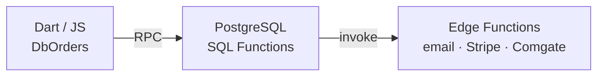

# Eshop (Orders, Tickets, Payments)

## Split Brain: Dart Reads, SQL Writes (CRITICAL)

Dart is a thin RPC wrapper. ALL write logic lives in SQL. Do NOT replicate multi-step logic in Dart -- causes race conditions.

## Atomic Order Changes (`confirm_blueprint_order_change`)

This SQL function handles the Old Order -> New Order atomic switch:
1. `analyze_new_order_spots` checks if spots are occupied
2. If occupied, cancels old tickets (`storno_tickets_bulk`)
3. Clears secrets, prepares new order JSON
4. Dart takes output and sends to `send-ticket-order` Edge Function

**Warning**: If modifying the "Claim" button, check this SQL path.

## Gotchas

- **Stringly Typed**: `OrderModel` fields mapped from `Tb` class strings. Renames break silently.
- **3-Layer Architecture**:

- **Storno RPC**: `update_order_and_tickets_to_storno_ws_221` -- the `_ws_221` suffix is not a typo

## SQL RPCs

- `select_spot` -- temporary spot lock with secret + expiration
- `confirm_blueprint_order_change` -- atomic seat reassignment with storno
- `update_order_and_tickets_to_paid_ws` -- marks order + tickets paid
- `update_order_and_tickets_to_storno_ws_221` -- cancels order + tickets
- `scan_ticket` -- validates + processes ticket scanning (enforces entrance limits)
- `get_report_ws` -- financial report for an occasion

## Occasion report snapshot

`public.get_report_ws(occasion_link text)` is the only report RPC. It checks the
caller's organization and order-view permission, then returns `{code: 200,
data: string, report: {...}}`. `report.schema_version` is 1; it contains occasion
ID/title, UTC snapshot time, spots, order/ticket state counts, money per currency,
confirmed products by ID, and warnings. IDs and numeric money are strings.
`data` is formatted from that same object for older clients. The Flutter text
view and UTF-8 TXT export share a localized formatter of `report`, using the
same translation keys as the graphical view.
The private invoker formatter has no table reads or client execution grants.

Payments are deduplicated before aggregation. Cross-occasion payment sharing or
order/payment currency mismatch returns 409 without a report. Missing access
returns 403; unexpected errors return a safe 500. No SQL details are exposed.
Anonymous execution is revoked. The old bigint helper and unused form-link
report wrappers are removed by the forward migration without CASCADE.

ReportTab keeps one snapshot per occasion/user/organization, ignores stale
responses, and refreshes only on explicit request or context change. Text and
export reuse the snapshot. Financial values describe current prices and stored
payment totals, including refunds; paid orders can have paid only a deposit.
Mobile products use a list; explanations work by tap and keyboard.
